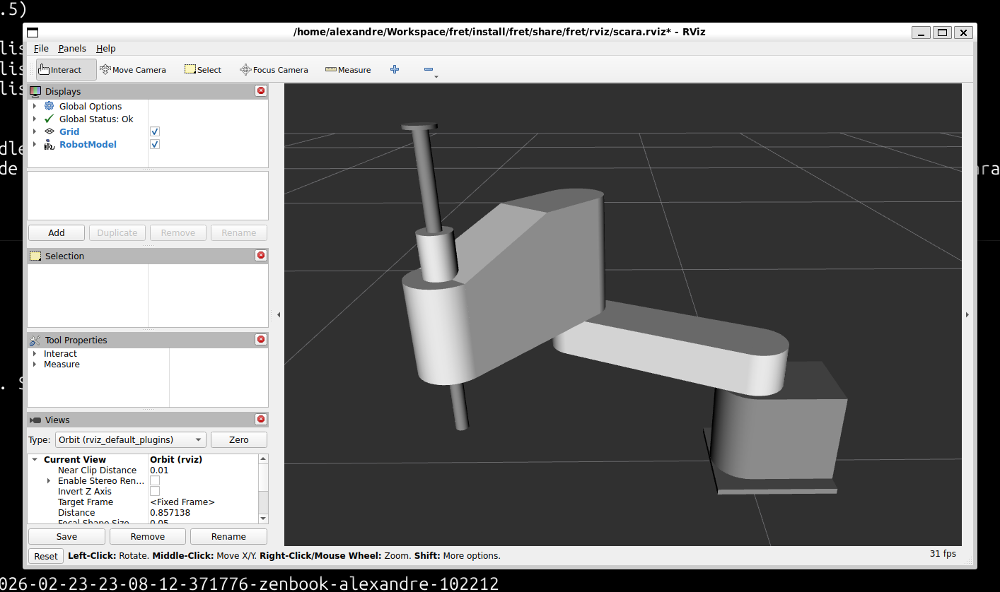

# FRET: Full-stack Robotic Effector Trajectories


FRET is a robotics development project focused on end-to-end effector trajectory execution across simulation and physical hardware.
The project adopts a progressive validation strategy: Software-In-The-Loop (SITL), Hardware-In-The-Loop (HITL), and physical prototype operation.

Core objectives include reliable kinematic control, robust trajectory tracking, real-time communication between control layers, and future vision-based closed-loop autonomy.

> The [Project Roadmap](docs/roadmap.md) is available in a dedicated file.

<br clear="all">

## System Specification

* **High-Level Controller:** Raspberry Pi 5 running Linux (Ubuntu).
* **Middleware:** ROS 2 (Humble/Jazzy) for high-level logic, kinematics, and communication.
* **Low-Level Controller:** Arduino Mega for deterministic actuation and signal processing.
* **Communication Layer:** Serial bridge (Micro-ROS or custom protocol) for command and telemetry exchange.
* **Simulation Stack:** URDF model with Gazebo/RViz for virtual validation.
* **Motion Planning:** Optimal (or near optimal) trajectory generation for pick-and-place applications.
* **Control Approach:** Jacobian-based trajectory tracking with feedback correction.
* **Mechanical/Electronic Baseline:** Stepper-class actuation (e.g., Nema 17) and precision drivers (e.g., TMC series).
* **Vision Expansion:** PiCam/Webcam integration for perception-driven replanning.

## Project Scope

FRET covers architectural design, simulation validation, hardware integration, physical calibration, and autonomous trajectory execution.
At this stage, the repository is dedicated to project definition and technical specification.
Tutorials and implementation-oriented documentation will be added incrementally as roadmap milestones are executed.

## Requirements

- Ubuntu 24.04 for ROS 2 Jazzy
- `git` must already be installed and configured on the host system.

The scripts validate it and abort if missing.

## Workspace structure

- Project source packages live in `./src`.
- All the useful scripts are located in `./scripts`. They automate the following tutorial steps.
- Generated files are written to `./build`, `./install`, and `./log`.

## Installing the development workspace

Install all current development dependencies via the script. It does **not** create, initialize, or build the ROS workspace. 

```bash
./scripts/install.sh -y
```

It includes:

* **System and build tools:** `build-essential`, `cmake`, `curl`, `gnupg2`, `lsb-release`, `software-properties-common`, `black`, `isort`.
* **ROS 2 stack (Jazzy):** `ros-jazzy-desktop`, `ros-dev-tools`, `python3-rosdep`, `python3-colcon-common-extensions`, `python3-vcstool`.
* **Simulation stack (Jazzy):** `gz-harmonic`, `ros-jazzy-ros-gz`, `ros-jazzy-ros-gz-sim`, plus RViz/URDF support packages.
* **Environment bootstrap:** `rosdep` initialization and update.
* **Python formatting tools:** `black` and `isort`.
* **C++ formatting tools:** `clang-format`.

> HITL dependencies (serial bridge runtime, firmware upload toolchains, and hardware-specific utilities) are not yet installed by this script and will be added in later stages.

## Setting up the ROS workspace

Use the setup script to configure the ROS workspace automatically.

```bash
./scripts/setup.sh -y
```

By default, `setup.sh` does **not** run dependency installation.
To run installation and setup in a single command, use:

```bash
./scripts/setup.sh --install -y
```

The setup script performs these steps:

1. Optionally runs `install.sh` when `--install` is provided.
2. Sources ROS 2 Jazzy for the setup session.
3. Ensures the source tree exists at `./src`.
4. Installs package dependencies from `src/` with `rosdep` (if packages exist).

## Build and run a sample

Build packages from `src/`:

```bash
./scripts/build.sh
```

Activate ROS + local overlay:

```bash
source /opt/ros/jazzy/setup.bash
source install/setup.bash
```

Run visualization from the unified launcher for RViz:

```bash
ros2 launch fret view.py model:=scara
```

Run simulation from the unified launcher for Gazebo:

```bash
ros2 launch fret sim.py model:=scara
```

> **How does PYTHONPATH get configured?**
> The fret environment hook (registered in CMakeLists.txt) automatically adds `share/` to PYTHONPATH when you source `install/setup.bash`. This allows Python to find and import fret modules without manual path configuration.

<div align="center">
  
  <p><em>RViz visualization of the SCARA model.</em></p>
</div>

## Models

Both `view.py` and `sim.py` require a model name parameter to specify which robot model to visualize or simulate.

### Available Models

| Model Name | Source | Description |
| --- | --- | --- |
| `scara` | Local (FRET) | Generic SCARA robot whose geometry was inspired from the [HiCNC RSR6600](https://www.hcnc-group.com/industrial-robot/scara-robot/4-axis-scara-robot.html). Specifications available in [`scara.md`](docs/scara/scara.md). |
| `ur3`, `ur5`, `ur10`, ... | External ROS package | Industrial robot models from externally maintained ROS description packages. See the respective package documentation for all available options. |

> The project [robot-descriptions/awesome-robot-descriptions](https://github.com/robot-descriptions/awesome-robot-descriptions) is a great resource for discovering additional robot description packages.

### Model File Resolution

The `view.py` and `sim.py` launchers use a flexible fallback mechanism to locate and load robot models. When you specify a model name, the system searches in the following order:

1. **Local URDF file:** `share/fret/urdf/<model>.urdf`
   - Pre-generated URDF files (converted from XACRO during build)
   - Fastest option as no compilation is required at runtime

2. **Local XACRO file:** `share/fret/urdf/<model>.xacro`
   - XACRO files are processed on-the-fly using the `xacro` command
   - Allows parametric descriptions with dynamic geometry generation

3. **External ROS package:** If the first two sources fail, the launcher attempts to load the model from an installed ROS description package
   - Search pattern: `<model>_description` ROS package with standard directory structure
   - Useful for reusing industrial robot descriptions and community contributions
   - Requires the corresponding ROS package to be installed in the workspace

If none of the above sources provide the model, a clear error message is displayed.

### Adding Custom Models

To add a new robot model:

1. **Create a XACRO file** in `src/fret/urdf/<model_name>.xacro`
   - Define robot structure, links, joints, materials, and inertial properties
   - The SCARA model in `scara.xacro` is a good reference

2. **Optional mesh generator** in `src/fret/mesh/<model_name>.py`
   - Required only if the model uses custom STL geometry (e.g. non-primitive shapes)
   - The script reads geometry constants directly from the XACRO and writes STL files at build time
   - No CMakeLists changes needed. The build loop auto-discovers `mesh/<model_name>.py`

3. **Optional RViz configuration** in `src/fret/rviz/<model_name>.rviz`
   - Automatically loaded if present; otherwise uses `default.rviz`
   - Configure initial view, object transparency, and visualization plugins

4. **Rebuild the workspace** to generate URDF files:
   ```bash
   ./scripts/build.sh
   ```

5. **Launch the model** with the model name matching your filename:
   ```bash
   ros2 launch fret view.py model:=<model_name>
   ros2 launch fret sim.py model:=<model_name>
   ```

### Project Structure

- **URDF/XACRO sources:** `src/fret/urdf/`
- **Generated URDF files:** `build/fret/generated/` (created during build)
- **RViz configurations:** `src/fret/rviz/`
- **Mesh generators:** `src/fret/mesh/` — Python scripts that produce STL files at build time
- **Generated STL files:** `build/fret/generated_meshes/<model_name>/` (created during build, installed to `share/fret/meshes/<model_name>/`)
- **C++ public headers:** `src/fret/include/fret/` — only symbols exposed to dependant packages
- **C++ private headers:** co-located with their `.cpp` under `src/fret/src/`
- **C++ sources:** `src/fret/src/`

## Python code

### Formatting

The project uses `black` and `isort` to ensure consistent Python formatting.

```bash
isort src
black src
```

### Unit Testing

Unit tests are pure Python tests using mocks, keeping them fast and independent of complex ROS dependencies. They use Python's built-in `unittest` framework.

All tests use mocked dependencies and don't require Gazebo, RViz, or other complex ROS infrastructure to run.

Build the workspace:

```bash
./scripts/build.sh
```

Source the ROS environment and the local workspace overlay:

```bash
source /opt/ros/jazzy/setup.bash
source install/setup.bash
```

Then run the tests:

```bash
python3 -m unittest discover tests -v
```

## C++ code

### Architecture

The C++ codebase follows a **namespace-mirrors-directory** convention: the directory a file lives in reflects the namespace it belongs to.

Public headers (exposed to dependant packages) live exclusively in `src/fret/include/fret/`. Private headers are co-located with their `.cpp` file.

#### Namespaces

| Namespace | Directory | Role |
|---|---|---|
| `fret::control` | `src/fret/src/control/` | Kinematics, Jacobian computation, feedback, controller registry |
| `fret::planning` | `src/fret/src/planning/` | Trajectory generation (lines, circles), path planning |
| `fret::hardware` | `src/fret/src/hardware/` | Serial / Micro-ROS bridge, driver abstraction |
| `fret::vision` | `src/fret/src/vision/` | Camera perception, target detection, visual feedback |

Namespaces are for reusable library layers only. Executable entry points (nodes) carry no namespace.

#### Nodes

Nodes are application entry points. They belong to the base `fret` namespace and live directly in `src/fret/src/`.

| Node | Roadmap phase | Subscribes | Publishes |
|---|---|---|---|
| `ControllerNode` | 2 (active) | `/joint_states`, TF | velocity commands |
| `PlannerNode` | 2 + 5 | goal inputs | trajectory reference → `ControllerNode` |
| `BridgeNode` | 3 | ROS command topics | serial / Micro-ROS to Arduino |
| `VisionNode` | 7 | camera | detected target poses → `PlannerNode` |

### Formatting

All `.cpp` and `.hpp` files are formatted with `clang-format` using the `.clang-format` file at the repository root.

```bash
find src -name '*.cpp' -o -name '*.hpp' | xargs clang-format -i
```

### Conventions

The project follows the [ROS 2 C++ style guide](https://docs.ros.org/en/rolling/The-ROS2-Project/Contributing/Code-Style-Language-Versions.html) (based on the Google C++ Style Guide):

- `CamelCase` for class and type names
- `snake_case` for function, method, and variable names
- `trailing_underscore_` for private and protected data members
- `UPPER_CASE` for constants and macros
- `snake_case` for file names

Public headers are documented with Doxygen using `/** */` block comments and `@brief`, `@param`, `@return` tags.

> Naming rules are not yet enforced by a linter. A `.clang-tidy` configuration will be added in a later step.

## Log analysis

Where logs are located:

- **Workspace build logs (colcon):** `./log/`
  - Latest build summary: `./log/latest_build/logger_all.log`
  - Build event stream: `./log/latest_build/events.log`
- **ROS 2 runtime logs (launch and nodes):** `~/.ros/log/`
  - Latest launch session: `~/.ros/log/latest/launch.log`
- **Gazebo Harmonic server logs:** `~/.gz/sim/log/<timestamp>/server_console.log`

For time-series analysis, [PlotJuggler](https://plotjuggler.io/) can be used:

```bash
sudo apt update
sudo apt install ros-jazzy-plotjuggler-ros
```

PlotJuggler analyzes ROS 2 **time-series data** (topics / bags), while text logs above are better for errors and warnings.

1. Run the simulator:

   ```bash
   source /opt/ros/jazzy/setup.bash
   source install/setup.bash
   ros2 launch fret sim.py model:=scara
   ```

2. In another terminal, record minimal data:

   ```bash
   source /opt/ros/jazzy/setup.bash
   source install/setup.bash
   mkdir -p log/bags
   ros2 bag record -o log/bags/sim_min /joint_states /clock
   ```

3. Open PlotJuggler and load the bag from `log/bags/sim_min`:

   ```bash
   source /opt/ros/jazzy/setup.bash
   ros2 run plotjuggler plotjuggler
   ```

Then drag signals from `/joint_states` to plot joint trends over time.

