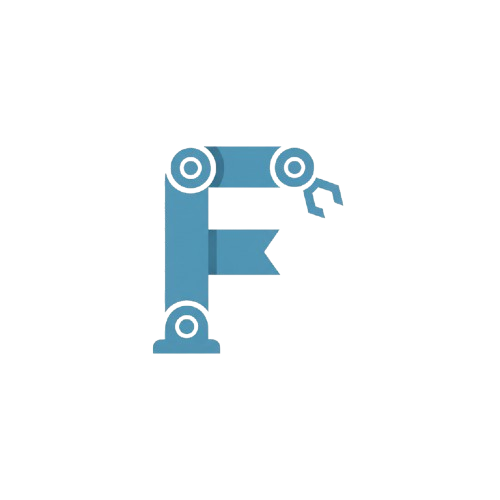

# FRET: Full-stack Robotic Effector Trajectories



FRET is a robotics development project focused on end-to-end effector trajectory execution across simulation and physical hardware.
The project adopts a progressive validation strategy: Software-In-The-Loop (SITL), Hardware-In-The-Loop (HITL), and physical prototype operation.

Core objectives include reliable kinematic control, robust trajectory tracking, real-time communication between control layers, and future vision-based closed-loop autonomy.

> The [Project Roadmap](docs/roadmap.md) available in a dedicated file.

<br clear="all">

## System Specification

* **High-Level Controller:** Raspberry Pi 5 running Linux (Ubuntu).
* **Middleware:** ROS 2 (Humble/Jazzy) for high-level logic, kinematics, and communication.
* **Low-Level Controller:** Arduino Mega for deterministic actuation and signal processing.
* **Communication Layer:** Serial bridge (Micro-ROS or custom protocol) for command and telemetry exchange.
* **Simulation Stack:** URDF model with Gazebo/RViz for virtual validation.
* **Motion Planning:** Optimal (or near optimal) trajectory generation for pick-and-place applications.
* **Control Approach:** Jacobian-based trajectory tracking with feedback correction.
* **Mechanical/Electronic Baseline:** Stepper-class actuation (e.g., Nema 17) and precision drivers (e.g., TMC series).
* **Vision Expansion:** PiCam/Webcam integration for perception-driven replanning.

## Project Scope

FRET covers architectural design, simulation validation, hardware integration, physical calibration, and autonomous trajectory execution.
At this stage, the repository is dedicated to project definition and technical specification.
Tutorials and implementation-oriented documentation will be added incrementally as roadmap milestones are executed.

## Requirements

- Ubuntu 24.04 for ROS 2 Jazzy
- `git` must already be installed and configured on the host system.

The scripts validate it and abort if missing.

## Installing the development workspace

Install all current development dependencies via the script. It does **not** create, initialize, or build the ROS workspace. 

```bash
./scripts/install.sh -y
```

It includes:

* **System and build tools:** `build-essential`, `cmake`, `curl`, `gnupg2`, `lsb-release`, `software-properties-common`.
* **ROS 2 stack (Jazzy):** `ros-jazzy-desktop`, `ros-dev-tools`, `python3-rosdep`, `python3-colcon-common-extensions`, `python3-vcstool`.
* **Simulation stack (Jazzy):** `gz-harmonic`, `ros-jazzy-ros-gz`, `ros-jazzy-ros-gz-sim`, plus RViz/URDF support packages.
* **Environment bootstrap:** `rosdep` initialization and update.

> HITL dependencies (serial bridge runtime, firmware upload toolchains, and hardware-specific utilities) are not yet installed by this script and will be added in later stages.

## Setting up the ROS workspace

Use the setup script to configure the ROS workspace automatically.

```bash
./scripts/setup.sh -y
```

By default, `setup.sh` does **not** run dependency installation.
To run installation and setup in a single command, use:

```bash
./scripts/setup.sh --install -y
```

The setup script performs these steps:

1. Optionally runs `install.sh` when `--install` is provided.
2. Sources ROS 2 Jazzy for the setup session.
3. Creates the local workspace structure at `./workspace/src`.
4. Installs package dependencies from `workspace/src` with `rosdep` (if packages exist).
5. Builds the workspace with `colcon` (if packages exist).

No project workspace files are required before this step. The workspace is created locally under `./workspace/` by the script.