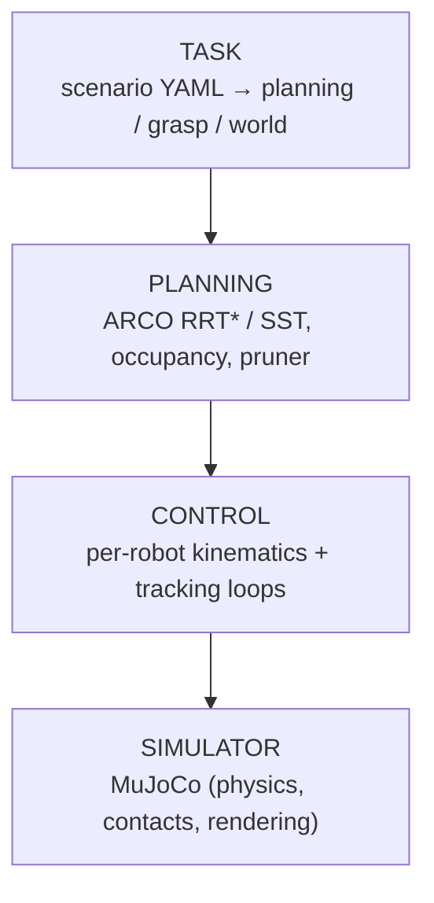
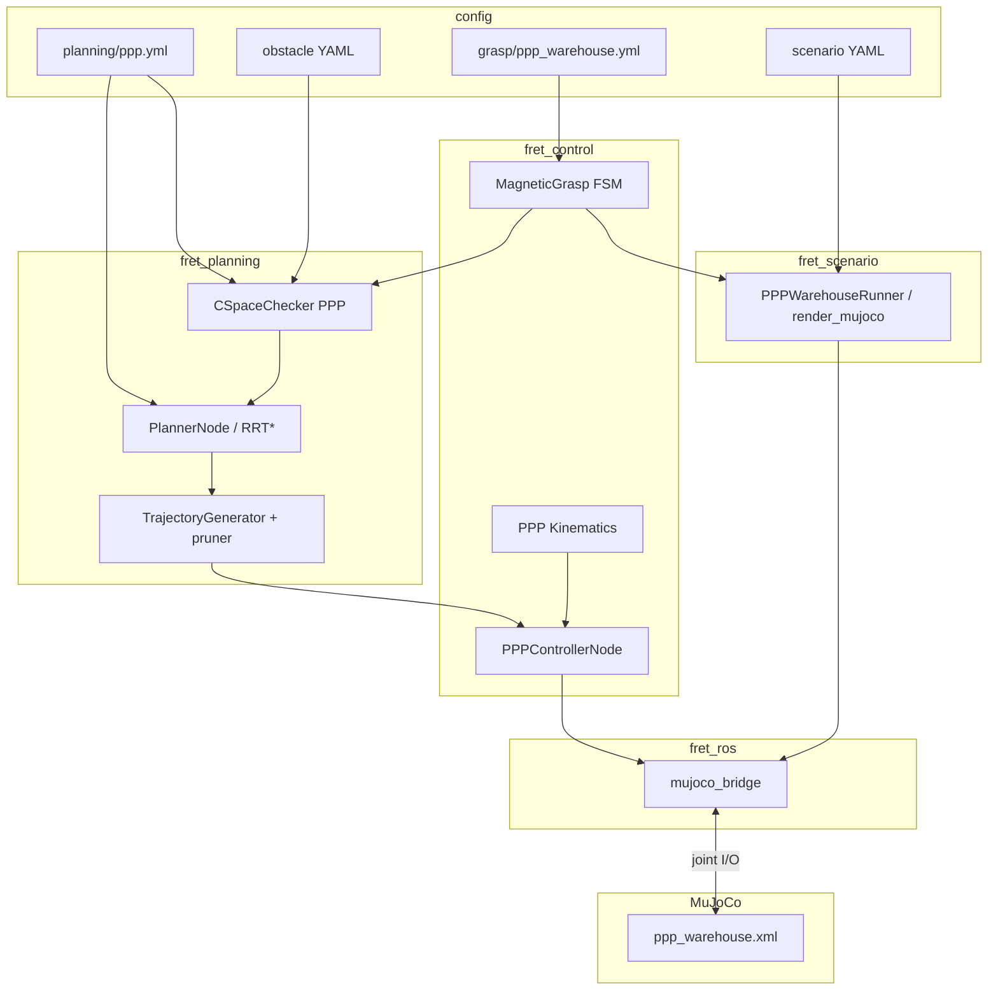
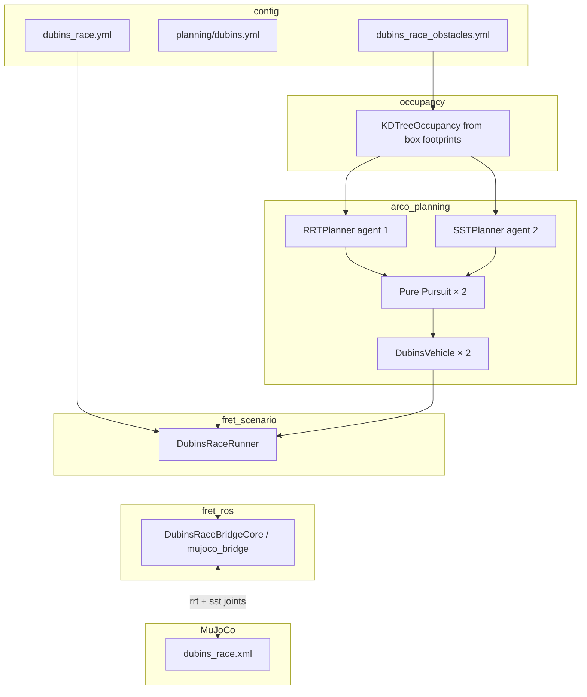

# FRET


**FRET** (Full-stack Robotic Effector Trajectories) is a ROS 2 robotics library that
connects the [ARCO](https://github.com/alexandrelheinen/arco) motion-planning stack to
MuJoCo simulation. Algorithm code lives in pure Python; a thin ROS 2 layer handles
topics, actions, and simulator I/O.

**Current release: v1.1** — PPP warehouse pick-and-place **and** a dual-agent Dubins
race through a rectangular structure forest with dead-end alcoves.

<br clear="left">

---

## What FRET provides

| Capability | v1.0 PPP gantry | v1.1 Dubins race |
|---|---|---|
| Robot model | 3-axis prismatic gantry (`ppp`) | Two SE(2) car-like agents (`dubins`) |
| Scenario | Warehouse box pick-and-place | Independent RRT* vs SST race A→B |
| Planning | ARCO RRT* in 3-D C-space | ARCO RRT* + SST in 2-D with structure occupancy |
| Control | Per-axis P-control + magnetic grasp FSM | ARCO Pure Pursuit + DubinsVehicle |
| Visual backend | MuJoCo MJCF (`ppp_warehouse.xml`) | MuJoCo MJCF (`dubins_race.xml`) |
| Showcase output | Overview + follow MP4 | Split-screen follow + overview MP4 |

Both scenarios ship with headless render scripts, pure-Python E2E tests (no ROS required
for CI validation), and optional ROS 2 SITL launch files.

**Coming next:** MuJoCo physics SITL (v1.2), RRP/SCARA ARCO reproduction (v1.3),
6-DOF challenge (v1.4). See [docs/roadmap.md](docs/roadmap.md) and
[docs/releases.md](docs/releases.md).

---

## What's inside the repository

```
src/fret/
├── control/           # Per-robot kinematics, controllers, magnetic grasp FSM
├── planning/          # PlannerNode, C-space checkers, trajectory post-processing
├── scenario/          # Pure-Python E2E orchestrators (PPP warehouse, Dubins race)
├── scene/             # Scene acquisition → occupancy adapter
├── ros/               # MuJoCo bridge, perception bridge, race node
├── validation/        # Metrics and quality gates
├── config/
│   ├── scenarios/     # Run definitions (start/goal, duration, config refs)
│   ├── planning/      # Algorithm tunables (clearance, trajectory, replanning)
│   ├── grasp/         # Magnetic grasp geometry and thresholds
│   ├── controllers/   # Per-model gains (ppp.yml, dubins.yml, …)
│   ├── worlds/        # Obstacle layouts + Dubins vehicle/planner tuning
│   └── simulation/    # MuJoCo bridge settings
├── mjcf/              # MuJoCo scenes (primary visual backend)
├── launch/            # sitl.py, mujoco.py
└── scripts/           # CLI entry points (render, view, download showcase)
```

**Regression infrastructure:** the bootstrap SCARA pipeline (MS-1–5) remains in the
codebase and CI for shared planning/control primitives; it is not a product release
target.

---

## Architecture

### Design principles

- **ROS 2** is the runtime middleware (topics, services, actions, parameters).
- **ARCO** is a synchronous library inside planner nodes — not a separate ROS node.
- **C-space** is the planning domain for manipulators; **SE(2)** for Dubins agents.
- **MuJoCo** is the simulation engine for physics, contacts, rendering, and SITL.
  v1.0–v1.1 use kinematic mirroring for showcase motion; v1.2 enables full
  actuator-driven physics (`mj_step`).
- **Simulator-specific code** lives only in `fret.ros` and `launch/`.
- **Configuration over code:** every tunable algorithm parameter (planning clearance,
  controller gains, grasp radii, trajectory limits, replanning thresholds, Dubins
  vehicle margins, and similar) **must live in YAML under `src/fret/config/`**.
  Python and MJCF must not embed numeric defaults for those values — missing keys
  fail at load time. Rendering-only constants (camera presets, mesh colours, UI
  layout) may stay hardcoded. Full reference: [docs/config.md](docs/config.md).

### Configuration (mandatory standard)

FRET uses a layered YAML config system loaded by `fret.config_loader`:

| Layer | Path | Examples |
|---|---|---|
| Scenario | `config/scenarios/*.yml` | start/goal, `planning_timeout`, `planning_config` ref |
| Planning | `config/planning/*.yml` | `contact_radius`, `max_interp_step_m`, replanning |
| Grasp | `config/grasp/*.yml` | `capture_radius`, `weld_offset` |
| Controller | `config/controllers/*.yml` | `kp`, `fault_threshold`, `max_joint_velocity` |
| World | `config/worlds/*.yml` | box obstacles, Dubins `vehicle.clearance_margin` |

Each scenario declares which algorithm configs to use:

```yaml
/**:
  ros__parameters:
    planning_config: planning/ppp.yml
    grasp_config: grasp/ppp_warehouse.yml   # PPP only
```

Per-scenario overrides merge into the referenced files (no Python edits required):

```yaml
    planning:
      contact_radius: 0.020
```

**Policy:** if changing a value alters planning, control, or grasp behavior, change
YAML only. Do not add fallbacks like `.get("key", 0.015)` in source. CI and code
review treat hardcoded tunables as defects.

**Tuning examples**

| Goal | Edit |
|---|---|
| PPP obstacle clearance | `config/planning/ppp.yml` → `contact_radius` |
| Dubins safety margin | `config/worlds/dubins_race_obstacles.yml` → `vehicle.clearance_margin` |
| PPP controller fault limit | `config/controllers/ppp.yml` → `fault_threshold` |

Load in Python:

```python
from fret.config_loader import load_scenario_bundle

bundle = load_scenario_bundle("config/scenarios/ppp_warehouse.yml")
contact_radius = bundle.planning["contact_radius"]
```

### Layer stack


```mermaid
flowchart TB
    TASK["TASK<br/>scenario YAML → planning / grasp / world"]
    PLANNING["PLANNING<br/>ARCO RRT* / SST, occupancy, pruner"]
    CONTROL["CONTROL<br/>per-robot kinematics + tracking loops"]
    SIMULATOR["SIMULATOR<br/>MuJoCo (physics, contacts, rendering)"]

    TASK --> PLANNING --> CONTROL --> SIMULATOR
```

### PPP warehouse data flow (v1.0)

Scenario YAML references `planning/ppp.yml` and `grasp/ppp_warehouse.yml` for all
tunable parameters (clearance, cruise heights, grasp radii). Obstacle geometry
comes from the path in `planning/ppp.yml` → `obstacle_file`
(`config/worlds/ppp_warehouse_preview_obstacles.yml`, MJCF 1:5 scale). The
magnetic grasp FSM welds the cargo box to the end-effector during transport so the
planner checks an enlarged EE envelope.


```mermaid
flowchart TB
    subgraph config
        SY[scenario YAML]
        PL[planning/ppp.yml]
        GY[grasp/ppp_warehouse.yml]
        OY[obstacle YAML]
    end

    subgraph fret_scenario
        RUN[PPPWarehouseRunner / render_mujoco]
    end

    subgraph fret_planning
        PN[PlannerNode / RRT*]
        CC[CSpaceChecker PPP]
        TG[TrajectoryGenerator + pruner]
    end

    subgraph fret_control
        KN[PPP Kinematics]
        GR[MagneticGrasp FSM]
        CN[PPPControllerNode]
    end

    subgraph fret_ros
        MB[mujoco_bridge]
    end

    subgraph MuJoCo
        MJ[ppp_warehouse.xml]
    end

    SY --> RUN
    PL --> PN
    PL --> CC
    GY --> GR
    OY --> CC
    CC --> PN
    PN --> TG --> CN
    KN --> CN
    GR --> CC
    GR --> RUN
    CN --> MB
    MB <-->|joint I/O| MJ
    RUN --> MB
```

### Dubins race data flow (v1.1)

Scenario YAML references `planning/dubins.yml`; vehicle footprint and planner ARCO
tunables live in `config/worlds/dubins_race_obstacles.yml`. Two agents share one
structure occupancy map built from rectangular footprints and dead-end alcoves.
Each agent runs its own ARCO planner (RRT* vs SST), then a Pure Pursuit tracking
loop. `DubinsRaceRunner` (or `render_mujoco.py`) steps both agents in lockstep and
mirrors poses into `dubins_race.xml`.


```mermaid
flowchart TB
    subgraph config
        SY[dubins_race.yml]
        PL[planning/dubins.yml]
        WY[dubins_race_obstacles.yml]
    end

    subgraph fret_scenario
        DR[DubinsRaceRunner]
    end

    subgraph occupancy
        KD[KDTreeOccupancy from box footprints]
    end

    subgraph arco_planning
        RRT[RRTPlanner agent 1]
        SST[SSTPlanner agent 2]
        PP[Pure Pursuit × 2]
        DV[DubinsVehicle × 2]
    end

    subgraph fret_ros
        DB[DubinsRaceBridgeCore / mujoco_bridge]
    end

    subgraph MuJoCo
        MJ[dubins_race.xml]
    end

    SY --> DR
    PL --> DR
    WY --> KD
    KD --> RRT
    KD --> SST
    RRT --> PP
    SST --> PP
    PP --> DV
    DV --> DR
    DR --> DB
    DB <-->|rrt + sst joints| MJ
```

### Robot model routing

Launch selects kinematics, collision checker, MJCF, and controller config via
`model:=` and `scenario:=`:

```bash
ros2 launch fret sitl.py scenario:=ppp_warehouse model:=ppp
ros2 launch fret sitl.py scenario:=dubins_race model:=dubins
```

| `model` | Release | Control strategy |
|---|---|---|
| `ppp` | v1.0 | Per-axis prismatic P-control |
| `dubins` | v1.1 | ARCO Pure Pursuit + DubinsVehicle |
| `rrp` / `scara` | v1.3 | Jacobian pseudoinverse (bootstrap exists) |
| `six_dof` | v1.4 | Jacobian + numerical IK (planned) |

Robot details: [docs/robots/README.md](docs/robots/README.md).

### ARCO boundary

| Owner | Responsibility |
|---|---|
| **ARCO** | KDTree occupancy, RRT* / SST, trajectory pruner, Dubins vehicle + Pure Pursuit |
| **FRET** | Scene acquisition, per-robot kinematics, grasp FSM, ROS I/O, MJCF worlds, E2E runners |

See [docs/arco.md](docs/arco.md) for integration notes.

### ROS interface summary

| Data | Mechanism | Message / type |
|---|---|---|
| Obstacles | Topic | `sensor_msgs/PointCloud2` |
| Joint state | Topic | `sensor_msgs/JointState` |
| Trajectory | Topic | `trajectory_msgs/JointTrajectory` |
| Commands | Topic | `std_msgs/Float64MultiArray` |
| Planning | Action | `PlanRequest.action` |
| Fault | Topic | `std_msgs/String` |

Full QoS and typed contracts: [docs/interfaces.md](docs/interfaces.md).

---

## Quick start

All Python workflows **must** use a virtual environment at the repository root:

```bash
python3 -m venv .venv
source .venv/bin/activate   # Linux / macOS / WSL
```

Do not `pip install` FRET or its dependencies into the system interpreter. The
`.venv` directory is gitignored — create it once per clone, then re-activate in
every new shell before `pip`, `pytest`, or MuJoCo scripts.

### 1. Clone and install (algorithms only)

No ROS required — runs the pure-Python test suite and E2E scenario validators.

```bash
git clone https://github.com/alexandrelheinen/fret.git
cd fret
python3 -m venv .venv
source .venv/bin/activate
pip install -e ".[dev]"

# Unit + scenario tests (excludes ROS launch_testing integration)
python3 -m pytest tests/ --ignore=tests/integration \
  -p no:launch_testing -p no:launch_ros -q
```

**PPP E2E only:**

```bash
python3 -m pytest tests/integration/test_scenario_ppp_warehouse.py -v
```

**Dubins race E2E only:**

```bash
python3 -m pytest tests/scenario/test_dubins_race_e2e.py -v
```

### 2. MuJoCo interactive viewer

Live 3D window (no ROS). All parameters are required — bare `./scripts/view.sh`
prints `missing arguments` and `--help`. With `.venv` activated:

```bash
source .venv/bin/activate
pip install -e ".[sim]"
./scripts/view.sh --model ppp --scenario ppp_warehouse \
  --duration 30 --fps 60 --camera overview
```

Headless MJCF check (CI-friendly):

```bash
python3 scripts/view_mujoco.py --model ppp --scenario ppp_warehouse \
  --duration 30 --fps 60 --camera overview --dry-run
```

### 3. Headless showcase videos

Renders MP4 clips using the same planners and controllers as release CI. With
`.venv` activated:

**PPP warehouse** — pick, cruise over obstacles, place (magnetic grasp visuals):

```bash
source .venv/bin/activate
pip install -e ".[sim]"
export MUJOCO_GL=egl PYOPENGL_PLATFORM=egl   # headless Linux / CI

./scripts/video.sh \
  --model ppp \
  --scenario ppp_warehouse \
  --collision-backend mujoco \
  --planner-algorithm rrt_star \
  --full-duration \
  --all-cameras \
  --output-dir /tmp/fret_ppp \
  --fps 30 --width 1280 --height 720
```

**Dubins race** — dual-agent RRT* vs SST with overview + split-screen follow:

```bash
./scripts/video.sh \
  --model dubins \
  --scenario dubins_race \
  --collision-backend mujoco \
  --planner-algorithm sst \
  --full-duration \
  --all-cameras \
  --output-dir /tmp/fret_dubins \
  --fps 30 --width 1280 --height 720
```

Single-camera Python API:

```bash
python3 scripts/render_mujoco.py --model ppp --scenario ppp_warehouse \
  --camera overview -o /tmp/ppp.mp4 --fps 30 --width 1280 --height 720 \
  --collision-backend mujoco --planner-algorithm rrt_star --full-duration
python3 scripts/render_mujoco.py --model dubins --scenario dubins_race \
  --camera overview -o /tmp/dubins.mp4 --fps 30 --width 1280 --height 720 \
  --collision-backend mujoco --planner-algorithm sst --full-duration
```

Visual walkthrough: [docs/tutorial.md](docs/tutorial.md) · WSL notes: [docs/wsl.md](docs/wsl.md)

### 4. Download release showcase clips

After a version tag, CI uploads overview + follow MP4s to Cloudflare R2:

```bash
./scripts/download_showcase.sh --list
./scripts/download_showcase.sh --tag v1.1.0 --all
./scripts/download_showcase.sh --scenario dubins_race --camera follow
```

Requires R2 credentials — see [.env.example](.env.example).

### 5. Full ROS 2 workspace (SITL)

Ubuntu 24.04 + ROS 2 Jazzy. Create and activate `.venv` first so Python deps
(including `pytest` and MuJoCo extras) stay isolated from system packages:

```bash
python3 -m venv .venv
source .venv/bin/activate
pip install -e ".[dev,sim]"

./scripts/install.sh -y
./scripts/setup.sh -y
./scripts/build.sh

source /opt/ros/jazzy/setup.bash
source install/setup.bash

# PPP warehouse MuJoCo SITL
ros2 launch fret sitl.py scenario:=ppp_warehouse model:=ppp

# Dubins dual-agent race
ros2 launch fret sitl.py scenario:=dubins_race model:=dubins
```

Pre-push quality gate (matches CI; `.venv` must be active):

```bash
source .venv/bin/activate
bash scripts/check/pre_push.sh
```

---

## Documentation

| Topic | Document |
|---|---|
| v1.2 physics implementation spec | [docs/mujoco_physics_v1.2.md](docs/mujoco_physics_v1.2.md) |
| Configuration reference | [docs/config.md](docs/config.md) |
| Scenario catalogue | [docs/scenarios.md](docs/scenarios.md) |
| Robot models | [docs/robots/README.md](docs/robots/README.md) |
| PPP gantry | [docs/robots/ppp.md](docs/robots/ppp.md) |
| Dubins race | [docs/robots/dubins.md](docs/robots/dubins.md) |
| MuJoCo integration | [docs/mujoco.md](docs/mujoco.md) |
| Simulation guide | [docs/simulation.md](docs/simulation.md) |
| ARCO integration | [docs/arco.md](docs/arco.md) |
| Interface contracts | [docs/interfaces.md](docs/interfaces.md) |
| Functional requirements | [docs/requirements.md](docs/requirements.md) |
| Module reference | [docs/modules/](docs/modules/) |

**Project management & engineering process**

| Topic | Document |
|---|---|
| Release specification (v1.0–v1.4) | [docs/releases.md](docs/releases.md) |
| Roadmap & milestones | [docs/roadmap.md](docs/roadmap.md) |
| Contributing & V-cycle | [CONTRIBUTING.md](CONTRIBUTING.md) |
| Coding guidelines | [docs/guidelines.md](docs/guidelines.md) |

---

## CI

With `.venv` activated:

```bash
source .venv/bin/activate
bash scripts/check/pre_push.sh
```

| Workflow | Checks |
|---|---|
| `tests.yml` | Parallel: unit shards (4×), coverage gate, smoke, integration |
| `formatting.yml` | Black, isort, clang-format |
| `type_check.yml` | mypy strict |
| `release.yml` | Showcase MP4 on version tags (PPP + Dubins) |

---

## License

MIT — see [LICENSE](LICENSE).
