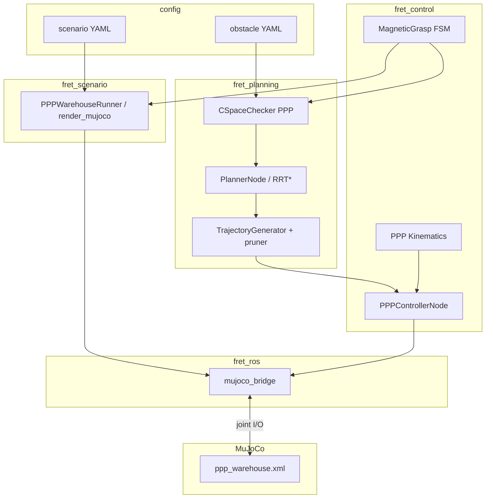
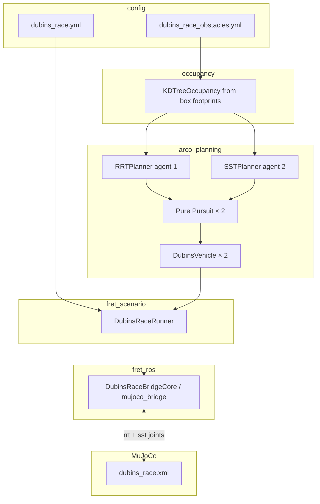

# FRET


**FRET** (Full-stack Robotic Effector Trajectories) is a ROS 2 robotics library that
connects the [ARCO](https://github.com/alexandrelheinen/arco) motion-planning stack to
MuJoCo (and, from v1.2, Gazebo) simulators. Algorithm code lives in pure Python; a thin
ROS 2 layer handles topics, actions, and simulator I/O.

**Current release: v1.1** — PPP warehouse pick-and-place **and** a dual-agent Dubins
race through a rectangular structure forest with dead-end alcoves.

<br clear="left">

---

## What FRET provides

| Capability | v1.0 PPP gantry | v1.1 Dubins race |
|---|---|---|
| Robot model | 3-axis prismatic gantry (`ppp`) | Two SE(2) car-like agents (`dubins`) |
| Scenario | Warehouse box pick-and-place | Independent RRT* vs SST race A→B |
| Planning | ARCO RRT* in 3-D C-space | ARCO RRT* + SST in 2-D with structure occupancy |
| Control | Per-axis P-control + magnetic grasp FSM | ARCO Pure Pursuit + DubinsVehicle |
| Visual backend | MuJoCo MJCF (`ppp_warehouse.xml`) | MuJoCo MJCF (`dubins_race.xml`) |
| Showcase output | Overview + follow MP4 | Split-screen follow + overview MP4 |

Both scenarios ship with headless render scripts, pure-Python E2E tests (no ROS required
for CI validation), and optional ROS 2 SITL launch files.

**Coming next:** RRP/SCARA ARCO reproduction (v1.2), 6-DOF challenge (v1.3). See
[docs/roadmap.md](docs/roadmap.md) and [docs/releases.md](docs/releases.md).

---

## What's inside the repository

```
src/fret/
├── control/           # Per-robot kinematics, controllers, magnetic grasp FSM
├── planning/          # PlannerNode, C-space checkers, trajectory post-processing
├── scenario/          # Pure-Python E2E orchestrators (PPP warehouse, Dubins race)
├── scene/             # Scene acquisition → occupancy adapter
├── ros/               # MuJoCo bridge, perception bridge, race node
├── validation/        # Metrics and quality gates
├── config/
│   ├── scenarios/     # SC-v10 (PPP), SC-v11 (Dubins), regression SC-01–05
│   ├── controllers/   # Per-model gains (ppp.yml, dubins.yml, …)
│   └── worlds/        # Obstacle layouts for planning + MJCF sync
├── mjcf/              # MuJoCo scenes (primary visual backend)
├── launch/            # sitl.py, sim.py, mujoco.py
└── scripts/           # CLI entry points (render, view, download showcase)
```

**Regression infrastructure:** the bootstrap SCARA pipeline (MS-1–5) remains in the
codebase and CI for shared planning/control primitives; it is not a product release
target.

---

## Architecture

### Design principles

- **ROS 2** is the runtime middleware (topics, services, actions, parameters).
- **ARCO** is a synchronous library inside planner nodes — not a separate ROS node.
- **C-space** is the planning domain for manipulators; **SE(2)** for Dubins agents.
- **MuJoCo** is the primary visual backend (v1.0+). Poses are written into MJCF
  joints; showcase motion is integrated in pure Python unless physics SITL is enabled.
- **Gazebo Harmonic** supports engineering SITL for arm releases (v1.2+).
- **Simulator-specific code** lives only in `fret.ros` and `launch/`.

### Layer stack

```
┌────────────────────────────────────────────────────────┐
│  TASK        scenario YAML, goals, grasp / race FSM    │
└────────────────────────────────────────────────────────┘
                         ▼
┌────────────────────────────────────────────────────────┐
│  PLANNING    ARCO RRT* / SST, occupancy, pruner        │
└────────────────────────────────────────────────────────┘
                         ▼
┌────────────────────────────────────────────────────────┐
│  CONTROL     per-robot kinematics + tracking loops     │
└────────────────────────────────────────────────────────┘
                         ▼
┌────────────────────────────────────────────────────────┐
│  SIMULATOR   MuJoCo (v1.0+) / Gazebo Harmonic (v1.2+)  │
└────────────────────────────────────────────────────────┘
```

### PPP warehouse data flow (v1.0)

Scenario YAML defines pick/place poses, grasp radii, and planner options. Obstacles
come from `config/worlds/ppp_warehouse_preview_obstacles.yml` (MJCF 1:5 scale). The
magnetic grasp FSM welds the cargo box to the end-effector during transport so the
planner checks an enlarged EE envelope.


```mermaid
flowchart TB
    subgraph config
        SY[scenario YAML]
        OY[obstacle YAML]
    end

    subgraph fret_scenario
        RUN[PPPWarehouseRunner / render_mujoco]
    end

    subgraph fret_planning
        PN[PlannerNode / RRT*]
        CC[CSpaceChecker PPP]
        TG[TrajectoryGenerator + pruner]
    end

    subgraph fret_control
        KN[PPP Kinematics]
        GR[MagneticGrasp FSM]
        CN[PPPControllerNode]
    end

    subgraph fret_ros
        MB[mujoco_bridge]
    end

    subgraph MuJoCo
        MJ[ppp_warehouse.xml]
    end

    SY --> RUN
    OY --> CC
    CC --> PN
    PN --> TG --> CN
    KN --> CN
    GR --> CC
    GR --> RUN
    CN --> MB
    MB <-->|joint I/O| MJ
    RUN --> MB
```

### Dubins race data flow (v1.1)

Two agents share one structure occupancy map built from rectangular footprints and
dead-end alcoves. Each agent runs its own ARCO planner (RRT* vs SST), then a Pure
Pursuit tracking loop. `DubinsRaceRunner` (or `render_mujoco.py`) steps both agents
in lockstep and mirrors poses into `dubins_race.xml`.


```mermaid
flowchart TB
    subgraph config
        SY[dubins_race.yml]
        WY[dubins_race_obstacles.yml]
    end

    subgraph fret_scenario
        DR[DubinsRaceRunner]
    end

    subgraph occupancy
        KD[KDTreeOccupancy from box footprints]
    end

    subgraph arco_planning
        RRT[RRTPlanner agent 1]
        SST[SSTPlanner agent 2]
        PP[Pure Pursuit × 2]
        DV[DubinsVehicle × 2]
    end

    subgraph fret_ros
        DB[DubinsRaceBridgeCore / mujoco_bridge]
    end

    subgraph MuJoCo
        MJ[dubins_race.xml]
    end

    SY --> DR
    WY --> KD
    KD --> RRT
    KD --> SST
    RRT --> PP
    SST --> PP
    PP --> DV
    DV --> DR
    DR --> DB
    DB <-->|rrt + sst joints| MJ
```

### Robot model routing

Launch selects kinematics, collision checker, MJCF, and controller config via
`model:=` and `scenario:=`:

```bash
ros2 launch fret sitl.py scenario:=ppp_warehouse model:=ppp backend:=mujoco
ros2 launch fret sitl.py scenario:=dubins_race model:=dubins backend:=mujoco
```

| `model` | Release | Control strategy |
|---|---|---|
| `ppp` | v1.0 | Per-axis prismatic P-control |
| `dubins` | v1.1 | ARCO Pure Pursuit + DubinsVehicle |
| `rrp` / `scara` | v1.2 | Jacobian pseudoinverse (bootstrap exists) |
| `six_dof` | v1.3 | Jacobian + numerical IK (planned) |

Robot details: [docs/robots/README.md](docs/robots/README.md).

### ARCO boundary

| Owner | Responsibility |
|---|---|
| **ARCO** | KDTree occupancy, RRT* / SST, trajectory pruner, Dubins vehicle + Pure Pursuit |
| **FRET** | Scene acquisition, per-robot kinematics, grasp FSM, ROS I/O, MJCF worlds, E2E runners |

See [docs/arco.md](docs/arco.md) for integration notes.

### ROS interface summary

| Data | Mechanism | Message / type |
|---|---|---|
| Obstacles | Topic | `sensor_msgs/PointCloud2` |
| Joint state | Topic | `sensor_msgs/JointState` |
| Trajectory | Topic | `trajectory_msgs/JointTrajectory` |
| Commands | Topic | `std_msgs/Float64MultiArray` |
| Planning | Action | `PlanRequest.action` |
| Fault | Topic | `std_msgs/String` |

Full QoS and typed contracts: [docs/interfaces.md](docs/interfaces.md).

---

## Quick start

### 1. Clone and install (algorithms only)

No ROS required — runs the pure-Python test suite and E2E scenario validators.

```bash
git clone https://github.com/alexandrelheinen/fret.git
cd fret
pip install -e ".[dev]"

# Unit + scenario tests (excludes ROS launch_testing integration)
python3 -m pytest tests/ --ignore=tests/integration \
  -p no:launch_testing -p no:launch_ros -q
```

**PPP E2E only:**

```bash
python3 -m pytest tests/integration/test_scenario_ppp_warehouse.py -v
```

**Dubins race E2E only:**

```bash
python3 -m pytest tests/scenario/test_dubins_race_e2e.py -v
```

### 2. MuJoCo interactive viewer

Live 3D window for the PPP warehouse gantry (no ROS):

```bash
pip install -e ".[sim]"
./scripts/view.sh                          # PPP warehouse
./scripts/view.sh --scenario dubins_race   # Dubins race world (static pose)
```

Headless check (CI-friendly):

```bash
python3 scripts/view_mujoco.py --dry-run
python3 scripts/view_mujoco.py --scenario dubins_race --dry-run
```

### 3. Headless showcase videos

Renders MP4 clips using the same planners and controllers as release CI.

**PPP warehouse** — pick, cruise over obstacles, place (magnetic grasp visuals):

```bash
pip install -e ".[sim]"
export MUJOCO_GL=egl PYOPENGL_PLATFORM=egl   # headless Linux / CI

./scripts/video.sh \
  --model ppp \
  --scenario ppp_warehouse \
  --collision-backend mujoco \
  --planner-algorithm rrt_star \
  --all-cameras \
  --output-dir /tmp/fret_ppp
```

**Dubins race** — dual-agent RRT* vs SST with overview + split-screen follow:

```bash
./scripts/video.sh \
  --model dubins \
  --scenario dubins_race \
  --all-cameras \
  --output-dir /tmp/fret_dubins
```

Single-camera Python API:

```bash
python3 scripts/render_mujoco.py --scenario ppp_warehouse -o /tmp/ppp.mp4
python3 scripts/render_mujoco.py --scenario dubins_race --camera overview -o /tmp/dubins.mp4
```

Visual walkthrough: [docs/tutorial.md](docs/tutorial.md) · WSL notes: [docs/wsl.md](docs/wsl.md)

### 4. Download release showcase clips

After a version tag, CI uploads overview + follow MP4s to Cloudflare R2:

```bash
./scripts/download_showcase.sh --list
./scripts/download_showcase.sh --tag v1.1.0 --all
./scripts/download_showcase.sh --scenario dubins_race --camera follow
```

Requires R2 credentials — see [.env.example](.env.example).

### 5. Full ROS 2 workspace (SITL)

Ubuntu 24.04 + ROS 2 Jazzy:

```bash
./scripts/install.sh -y
./scripts/setup.sh -y
./scripts/build.sh

source /opt/ros/jazzy/setup.bash
source install/setup.bash

# PPP warehouse MuJoCo SITL
ros2 launch fret sitl.py scenario:=ppp_warehouse model:=ppp backend:=mujoco

# Dubins dual-agent race
ros2 launch fret sitl.py scenario:=dubins_race model:=dubins backend:=mujoco
```

Pre-push quality gate (matches CI):

```bash
bash scripts/check/pre_push.sh
```

---

## Documentation

| Topic | Document |
|---|---|
| Scenario catalogue | [docs/scenarios.md](docs/scenarios.md) |
| Robot models | [docs/robots/README.md](docs/robots/README.md) |
| PPP gantry | [docs/robots/ppp.md](docs/robots/ppp.md) |
| Dubins race | [docs/robots/dubins.md](docs/robots/dubins.md) |
| MuJoCo / simulation | [docs/simulation.md](docs/simulation.md) |
| ARCO integration | [docs/arco.md](docs/arco.md) |
| Interface contracts | [docs/interfaces.md](docs/interfaces.md) |
| Functional requirements | [docs/requirements.md](docs/requirements.md) |
| Module reference | [docs/modules/](docs/modules/) |

**Project management & engineering process**

| Topic | Document |
|---|---|
| Release specification (v1.0–v1.3) | [docs/releases.md](docs/releases.md) |
| Roadmap & milestones | [docs/roadmap.md](docs/roadmap.md) |
| Contributing & V-cycle | [CONTRIBUTING.md](CONTRIBUTING.md) |
| Coding guidelines | [docs/guidelines.md](docs/guidelines.md) |

---

## CI

```bash
bash scripts/check/pre_push.sh
```

| Workflow | Checks |
|---|---|
| `tests.yml` | Build, pytest, smoke |
| `formatting.yml` | Black, isort, clang-format |
| `type_check.yml` | mypy strict |
| `integration.yml` | launch_testing |
| `release.yml` | Showcase MP4 on version tags (PPP + Dubins) |

---

## License

MIT — see [LICENSE](LICENSE).
