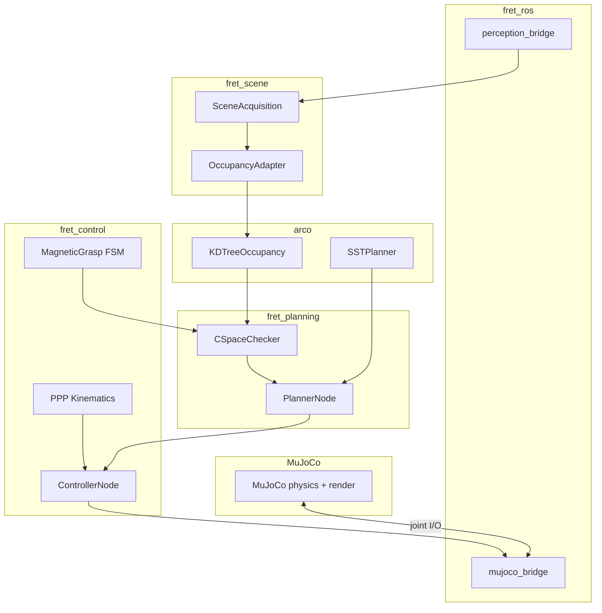

# FRET Architecture

> **Release targets:** [releases.md](releases.md)

---

## Design principles

- **ROS 2** is the runtime middleware (topics, services, actions, parameters).
- **ARCO** is a synchronous library inside `PlannerNode` — not a ROS node.
- **C-space** is the planning domain for all manipulator releases.
- **MuJoCo** is the primary visual backend (v1.0+).
- **Gazebo** supports engineering SITL for arm releases (v1.2+).
- **Simulator-specific code** lives only in `fret.ros` and `launch/`.

---

## Layer diagram

```
┌────────────────────────────────────────────────────────┐
│  TASK LAYER         scenario YAML, goals, grasp FSM    │
└────────────────────────────────────────────────────────┘
                         ▼
┌────────────────────────────────────────────────────────┐
│  PLANNING LAYER     ARCO SST, KDTree, post-process     │
└────────────────────────────────────────────────────────┘
                         ▼
┌────────────────────────────────────────────────────────┐
│  CONTROL LAYER      per-robot kinematics + tracking    │
└────────────────────────────────────────────────────────┘
                         ▼
┌────────────────────────────────────────────────────────┐
│  SIMULATOR LAYER    MuJoCo (v1.0+) / Gazebo (v1.2+)    │
└────────────────────────────────────────────────────────┘
```

---

## Data flow (v1.0 PPP)



---

## Per-release control strategy

| Release | Robot | Control |
|---|---|---|
| v1.0 | PPP | Per-axis velocity (prismatic P-control) |
| v1.1 | Dubins × 2 | ARCO Pure Pursuit |
| v1.2 | RRP | Jacobian pseudoinverse |
| v1.3 | 6-DOF | Jacobian pseudoinverse + numerical IK |

---

## File organization

```
src/fret/
├── control/           # Kinematics (per model), ControllerNode, grasp FSM
├── planning/          # PlannerNode, CSpaceChecker, trajectory chain
├── scene/             # Scene acquisition, occupancy adapter
├── ros/               # Simulator bridges (mujoco_bridge, perception_bridge)
├── validation/        # Metrics, quality gates
├── hardware/          # HITL stub (post v1.3)
├── launch/            # view.py, sim.py, sitl.py, mujoco.py
├── config/
│   ├── scenarios/     # SC-v10 – SC-v13 + regression SC-01–05
│   └── controllers/   # Per-model gain files
├── mjcf/              # MuJoCo models (v1.0+)
├── urdf/              # Gazebo models (scara bootstrap; ppp, six_dof planned)
└── worlds/            # SDF worlds
```

---

## Robot model routing

`model:=` selects kinematics, collision checker, URDF/MJCF, and controller config.
See [robots/README.md](robots/README.md).

---

## ARCO boundary

| Owner | Responsibility |
|---|---|
| ARCO | KDTree occupancy, SST/RRT*, pruner, Dubins/Pure Pursuit (v1.1) |
| FRET | Scene acquisition, per-robot kinematics, grasp FSM, ROS I/O, sim backends |

Details: [arco.md](arco.md).

---

## Middleware summary

| Data | Mechanism | Message |
|---|---|---|
| Obstacles | Topic | `sensor_msgs/PointCloud2` |
| Joint state | Topic | `sensor_msgs/JointState` |
| Trajectory | Topic | `trajectory_msgs/JointTrajectory` |
| Commands | Topic | `std_msgs/Float64MultiArray` |
| Planning | Action | `PlanRequest.action` |
| Fault | Topic | `std_msgs/String` |

Full QoS: [interfaces.md](interfaces.md).
