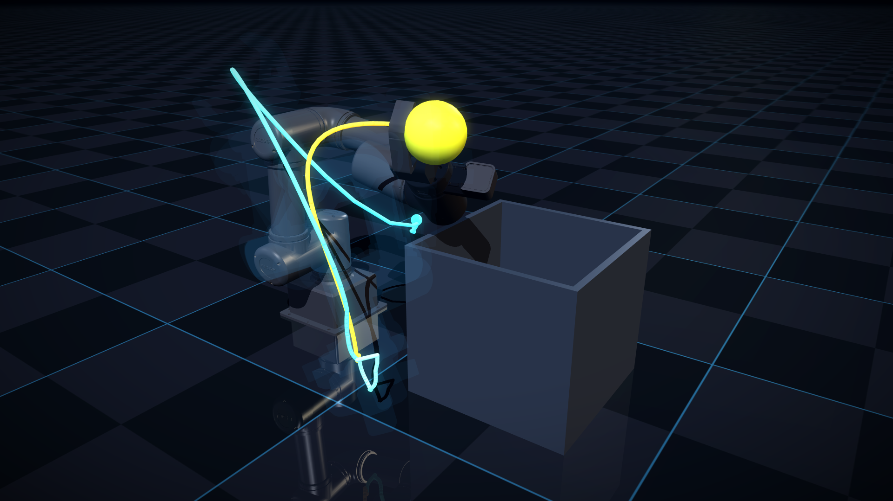

# Illustration gallery

The gallery is FRET's set of **16:9 still plates** for the website card,
investor decks, talks, and paper figures. Each plate is a frame of a real
run: ARCO plans it, a FRET controller tracks it, MuJoCo steps the physics.
Staging (lights, camera, grade) is art direction; the run is not.

Render everything:

```bash
MUJOCO_GL=egl python3 scripts/release/render_gallery.py --all
```

Plates land in `docs/images/gallery/`. Simulations are cached under
`build/gallery_cache/` (gitignored), so re-framing a plate costs a render,
not a re-run. Use `--refresh-sim` to force new runs.

---

## The plates

| Plate | Scenario | What it shows |
| --- | --- | --- |
| `omy_transfer` | `omy_pick_place` (SC-v14b) | OMY carrying the ball to the place bin, executed tool path in FSM-phase colours |
| `omy_grasp` | `omy_pick_place` | Contact-level close-up of the grasp, camera locked to the tool |
| `omx_wall_maze` | `omx_wall_maze_rrt` (SC-v13d) | OM-X threading the Γ wall maze on the RRT* transfer plan |
| `omy_clutter` | `omy_clutter_rrt` (SC-v14c) | OMY transfer in the clutter cell, joint-space MPC with C-space barriers |
| `dubins_duel` | `dubins_race` (SC-v11) | RRT* and SST vehicles at the goal, both driven tracks converging |
| `dubins_atlas` | `dubins_race` | The finished race read as a map of the whole warehouse floor |

List them from the CLI with `--list`; the matrix itself is
[`src/fret/config/release/gallery.yml`](../src/fret/config/release/gallery.yml).



---

## Visual language

**Backdrop.** A dark blue-grey gradient sky over a near-black floor. The
robot is the only bright object, so the plate works as a card thumbnail at
400 px and as a slide background at 4 K.

**Light rig.** Four *directional* lights replace the scene's own lighting:
a warm key (casting the only shadow), a cool fill, a cyan rim that
separates dark robot links from the dark backdrop, and a warm kicker on
the opposite side. Directional lights are scale-free, so the same rig
lights a 0.65 m tabletop cell and an 11 m warehouse identically.

**Palette.** Cyan `#3DC2FA`, mint `#59EBB3`, amber `#FCA82E`, violet
`#B873FA`. On arms the trajectory ribbon is coloured by FSM phase
(approach → grasp → transfer → place). In the race, colour maps to
planner: cyan is RRT*, amber is SST — and the vehicles themselves are
repainted to match, so a car and its track read as one object.

**Motion.** Ghost passes render only the moving bodies, flat and
unlit on black, then screen over the beauty frame at 3–9 % each. The
result is a multi-exposure trail of the poses the planner actually
produced, not a motion-blur effect.

**Grade.** Threshold bloom, a mild contrast curve around a 0.45 pivot,
and a vignette. Plates render at 2× and are box-filtered down, which is
cheaper than more MSAA and cleaner on thin trajectory capsules.

---

## What staging may and may not touch

Allowed: lights, materials (colour, specular, reflectance, emission),
backdrop textures, camera framing, post-grade, and overlay geoms that
draw *recorded* data (executed tracks, planned paths, markers).

Not allowed: moving a body, editing a trajectory, hiding an obstacle the
robot had to avoid, or picking a frame from a failed run. Every plate's
driver asserts the run reached `DONE` (and, for the clutter cells, that
wall contacts were zero) before a pixel is rendered.

Two deliberate scenery edits are documented in the renderer: the CV
gate's translucent portal panel is hidden (it is a visualisation aid, and
it veils the arm), and the start/goal zone markers are desaturated so
they stop dominating the frame. Their geometry stays where the scenario
put it.

---

## Adding or re-framing a plate

Plates are data. Edit `gallery.yml`:

```yaml
  - id: my_plate
    model: omy
    scenario: omy_pick_place
    source: pick_place          # pick_place | clutter | dubins
    output: fret_my_plate.png
    caption: One sentence, used in docs and alt text.
    hero: {state: 5, at: 0.85}  # FSM phase + fraction inside it
    camera:
      lookat: [0.34, -0.05, 0.24]
      track: tool               # optional: "tool", an agent, or "pack"
      distance: 1.15
      azimuth: 125.0
      elevation: -22.0
      fovy: 42.0
    ghosts:
      count: 6
      span: [0.05, 0.70]
      weight: [0.03, 0.08]
      bodies: [link1, link2, link3]
    trace: {width: 0.003, show_future: false}
```

Then iterate cheaply:

```bash
MUJOCO_GL=egl python3 scripts/release/render_gallery.py \
    --plate my_plate --supersample 1 --output-dir /tmp/plates
```

The manifest rejects non-16:9 sizes, duplicate ids, and outputs that are
not `.png`, so a bad plate fails before the renderer starts. Manifest and
grading helpers are unit-tested in
[`tests/release/test_gallery_manifest.py`](../tests/release/test_gallery_manifest.py).

---

## Environment

Rendering needs the `sim` extra and a GL backend:

```bash
pip install -e ".[sim]"
MUJOCO_GL=egl        # headless (cloud agents, CI)
MUJOCO_GL=glfw       # WSL2 with WSLg, where EGL fails to initialise
```

See [docs/dev-environment.md](dev-environment.md) for the headless notes
and [docs/mujoco.md](mujoco.md) for the video renderer these plates share
their simulations with.
