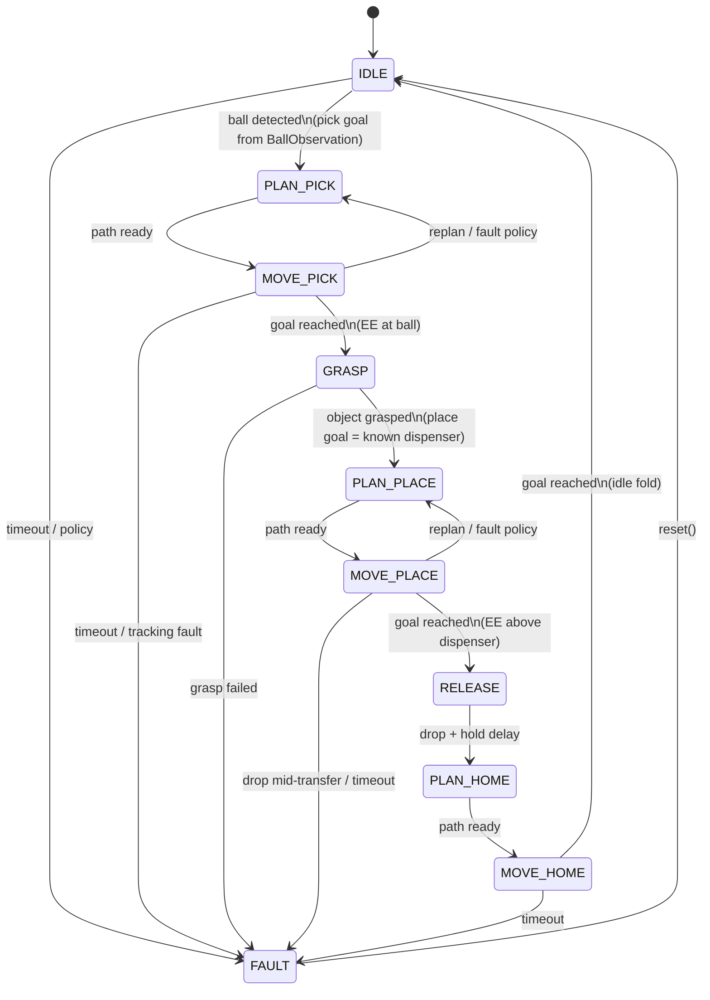
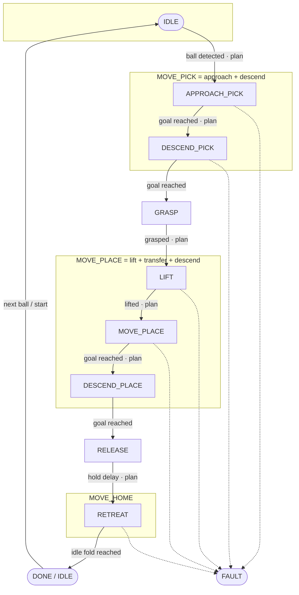

# Pick-and-place FSM

**Package:** `fret.control.pick_place_fsm`  
**Source:** `src/fret/control/pick_place_fsm.py`  
**Tests:** `tests/control/test_pick_place_fsm.py`

> **Scope:** robot-agnostic manipulation cycle for OM-X, OMY, and future arms.
> Vision supplies the **pick** pose; the **place / dispenser** pose is a known
> scenario parameter. Path planning runs on **every arm motion** between phases.

Related: [control.md](control.md) · [vision/architecture.md](../vision/architecture.md) ·
[interfaces.md § Vision](../interfaces.md#vision--manipulation-boundary-v13)

---

## Responsibility

Encode the pick → place → home task as a finite-state machine that:

1. Waits in **IDLE** until a ball is available (`BallObservation` / scenario start).
2. Builds an EE / joint **pick goal** from the detected ball pose.
3. Requests a **path plan** and tracks it to the ball.
4. Closes the gripper and confirms grasp.
5. Builds a **place goal** from the known dispenser / thrower pose.
6. Requests a **new path plan** and tracks it to the dispenser.
7. Opens the gripper (drop), waits a short hold.
8. Plans back to the **idle** fold and returns to **IDLE**.

The FSM is pure Python: it does **not** call MuJoCo, ROS, or a specific
kinematics model. Robot differences (DOF, gripper open/close values, IK) are
injected via `GripperSpec`, `PickPlaceWaypoints`, and the runner’s planner /
tracker.

---

## Logical cycle (product view)



| Logical state | Trigger in | Trigger out | Path planning? |
| --- | --- | --- | --- |
| **IDLE** | boot / home arrived | `ball_detected` | no |
| **PLAN_PICK** | ball pose known | plan success | **yes** — `q_now → q_pick` |
| **MOVE_PICK** | plan accepted | joint/EE goal reached | tracking only |
| **GRASP** | at pick | hold + contact OK | no (gripper only) |
| **PLAN_PLACE** | grasped | plan success | **yes** — `q_now → q_place` |
| **MOVE_PLACE** | plan accepted | at dispenser | tracking only |
| **RELEASE** | at place | open + `release_hold_s` | no |
| **PLAN_HOME** | drop done | plan success | **yes** — `q_now → q_idle` |
| **MOVE_HOME** | plan accepted | idle reached | tracking only |
| **FAULT** | any phase timeout / drop | `reset()` | no |

Place / dispenser XY is **never** estimated by vision in v1.4–v1.5; it comes
from scenario YAML (`place_xy` + place joint waypoints).

---

## Implementation mapping (physics-grade substates)

Runners need hover / descend splits for reliable pad contact and cone clearance.
The implementation enum expands each logical **MOVE_*** into substates. Every
arm motion still goes through the planning pipeline (free-space chord or
collision-aware RRT* via `PlannerNode`).



| `PickPlaceState` | Logical role | Runner plans to |
| --- | --- | --- |
| `IDLE` | wait / hold idle fold | — |
| `APPROACH_PICK` | MOVE_PICK (hover) | `pick_hover` |
| `DESCEND_PICK` | MOVE_PICK (grasp) | `pick_grasp` |
| `GRASP` | close gripper | — |
| `LIFT` | MOVE_PLACE (clear) | `lift_hover` |
| `MOVE_PLACE` | MOVE_PLACE (transfer) | `place_hover` (+ walls via planner) |
| `DESCEND_PLACE` | MOVE_PLACE (drop pose) | `place_grasp` |
| `RELEASE` | open + delay | — |
| `RETREAT` | MOVE_HOME | `place_hover` clear, then `idle`/`retreat` |
| `DONE` | cycle complete (idle pose held) | — |
| `FAULT` | safe open / hold | — |

`DONE` holds the idle joint command (same as idle). Call `start()` or set
`ball_detected` again to begin the next cycle. `reset()` clears FAULT → IDLE.

---

## Robot independence

| Concern | Where it lives | Not in the FSM |
| --- | --- | --- |
| DOF | `PickPlaceWaypoints` length / `dof=` | FK/IK model |
| Gripper open/close | `GripperSpec` (OMX / OMY presets) | Menagerie joint names |
| Pick pose from vision | runner updates waypoints / goals | HSV, cameras |
| Place / dispenser | scenario YAML → waypoints | mesh asset |
| Path planning | `JointPathPlanner` protocol in runner | ARCO RRT* internals |
| Tracking | `JointPathMPCTracker` / MPC | CasADi |

```text
BallObservation ──► runner (IK / waypoint update)
                         │
                         ▼
              PickPlaceFSM.tick(obs) ──► PickPlaceCommand
                         │                    │
                         │                    ├─ state, gripper
                         │                    └─ plan_goal / needs_plan
                         ▼
              JointPathPlanner.plan(q, goal) ──► JointPathMPCTracker
                         │
                         ▼
                    MuJoCo / hardware actuators
```

---

## Configuration knobs

| Parameter | Role |
| --- | --- |
| `joint_tol_rad` | “goal reached” in joint space |
| `grasp_hold_s` / `release_hold_s` | gripper timing |
| `lift_height_m` | object-z success + drop-fault threshold |
| `phase_timeout_s` | → `FAULT` |
| `require_grasp_contact` | OMY pad contact gate before leaving GRASP |
| `drop_fault_enabled` | mid-transfer object-z watch |

---

## Satisfies / related

| ID | Note |
| --- | --- |
| SC-v13b / SC-v14b | Physics pick-place smoke |
| SC-v13c/d · OMY clutter | `MOVE_PLACE` uses wall-aware planner |
| v1.4 T14-03 | Wire `BallObservation` into pick goal (IDLE trigger) |
