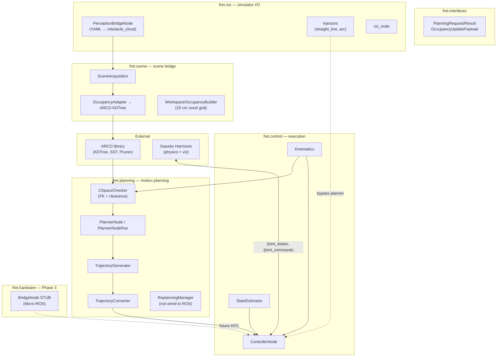
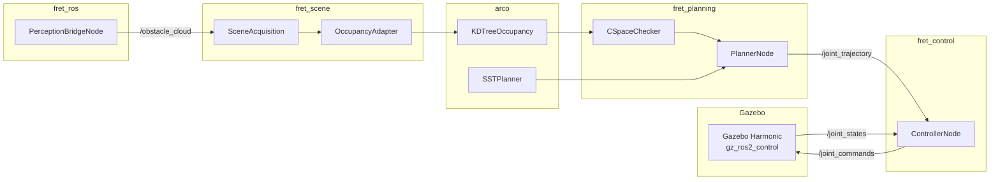
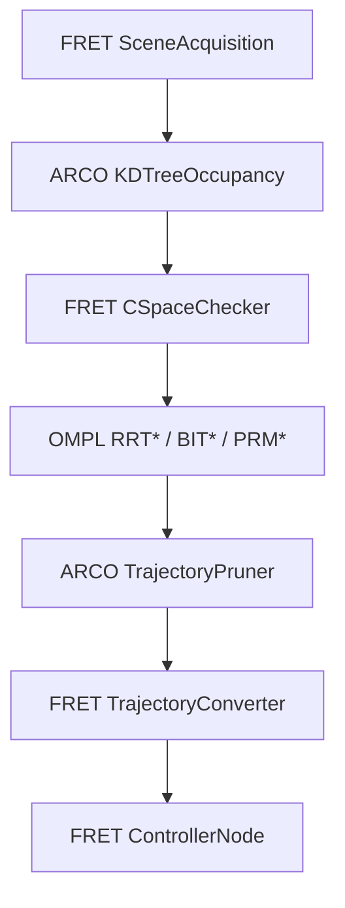
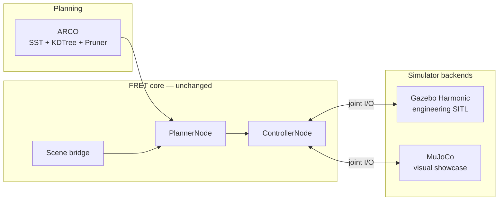

# FRET Platform Study — Robotics Simulation Landscape (2026 Q3)

> **Status:** Accepted architectural direction for FRET v1.0  
> **Date:** July 2026  
> **Audience:** FRET contributors, ARCO integrators, and future article on the state of robotics simulation  
> **Related:** [Architecture](../architecture.md) · [Roadmap](../roadmap.md) · [v1.0 Goals](../v1.0.md) · [ARCO Integration](../arco.md)

---

## Executive summary

**FRET** (Full-stack Robotic End-effector control and Trajectory planning) is a ROS 2 Jazzy
workspace that connects the **ARCO** motion-planning library to a manipulator simulation
stack. The project deliberately separates pure-Python algorithm layers from a thin ROS 2
I/O layer.

After completing Milestones 1–5 on a **3-DOF SCARA** with **Gazebo Harmonic** as the
engineering simulator, this study evaluates alternative simulation and planning platforms
and records the **accepted direction for v1.0**:

| Layer | v1.0 choice | Role |
|---|---|---|
| **Motion planning** | **ARCO** (Python) | Ownership, lightweight API, C-space SST |
| **Engineering SITL** | **Gazebo Harmonic** | ROS-native integration, CI, hardware path |
| **Visual showcase** | **MuJoCo** | Pretty, fast, credible manipulation demos |

The SCARA was the natural first robot because it was already validated on ARCO. The **v1.0
showcase scenario** (robot + environment) is intentionally deferred to a follow-up design
session once this documentation is in place.

---

## 1. Current state of development

### 1.1 Maturity snapshot

| Area | Status |
|---|---|
| **MS-1 → MS-5** (control → planning → pillar avoidance) | ✅ Done in pure-Python CI; tracking error **0.56 mm** vs 5 mm limit |
| **Control stack** | ✅ Jacobian tracking at 50 Hz, FK/IK, state estimator, FSM |
| **Planning stack** | ✅ C-space SST via ARCO, `CSpaceChecker`, trajectory post-processing |
| **Scene / occupancy** | ✅ YAML-driven obstacle clouds → `KDTreeOccupancy` |
| **Gazebo SITL** | 🟡 Launch files, URDF + `gz_ros2_control`, worlds exist; live perception not wired |
| **Hardware HITL** | 🔲 Stub only (`bridge_node` not implemented) |

### 1.2 Known gaps

- The simulator bridge is **not one module** — it is a multi-stage pipeline (see §2).
- Obstacles are **config-driven** (`perception.yaml`), not yet sensed live from Gazebo sensors/TF.
- CI runs **without ARCO** (linear-interpolation fallback); real SST is optional locally.
- `ReplanningManager` exists but is **not wired** into the live ROS pipeline.
- **OMPL, MuJoCo, and Isaac** were not referenced in the codebase at the time of this study.

### 1.3 Bottom line

The architecture and algorithm path are solid through MS-5. What remains thin is the
**simulator-facing perception layer**, **Gazebo end-to-end CI validation**, and the
**visual showcase backend**. For a portfolio or article, the bottleneck is less “which
planner?” and more “how impressive and believable does the simulation look?”

---

## 2. Topography of the existing project

The bridge between ARCO and the simulator is a pipeline, not a single class:

### 2.1 Package map

| Layer | Path | Role |
|---|---|---|
| Contracts | `src/fret/interfaces/` | Typed payloads, no ROS |
| Simulator bridge | `src/fret/ros/` | Obstacle clouds, injectors, visualization |
| ARCO bridge | `src/fret/scene/` | Point cloud → occupancy |
| Planning | `src/fret/planning/` | C-space planning + post-processing |
| Control | `src/fret/control/` | Kinematics + Jacobian execution |
| Validation | `src/fret/validation/` | Metrics + quality gates |
| Launch / worlds | `launch/`, `worlds/`, `urdf/` | Gazebo SITL entry points |
| Config | `config/scenarios/`, `benchmark.yaml` | Reproducible runs |

### 2.2 ARCO ownership boundary

From [ARCO Integration](../arco.md):

| Responsibility | Owner |
|---|---|
| Occupancy representation (`KDTreeOccupancy`) | ARCO |
| Planner logic (SST, RRT*, sampling, diagnostics) | ARCO |
| Scene acquisition, frame transforms | FRET |
| Robot state, FK/IK, Jacobian | FRET |
| Control, execution, TF broadcast | FRET |

ARCO must not read ROS topics. FRET must not call ARCO planner internals beyond the public API.

### 2.3 Data flow (Gazebo SITL, current)

---

## 3. Study A — Simulation platforms

**Question:** Which simulator balances ease of use against realistic, impressive, and
beautiful results?

### 3.1 Comparison table

| Criterion (1 = low, 5 = high) | **Gazebo Harmonic** (current) | **MuJoCo** | **Isaac Sim** |
|---|---:|---:|---:|
| **Ease of integration with FRET/ROS 2** | 5 — already wired (`ros_gz_sim`, `gz_ros2_control`) | 2 — needs new bridge (`mujoco_ros2_control` or custom) | 2 — heavy setup (Isaac ROS, GPU, Omniverse) |
| **Interface weight / cognitive load** | 3 — SDF, plugins, bridges; familiar ROS mental model | 4 — small MJCF API, fast iteration once bridged | 1 — large stack, versioning pain |
| **Physics realism (manipulation)** | 3 — adequate for SCARA joint tracking | 5 — contact, friction, stability | 4 — good, tuned for robotics research |
| **Visual impressiveness** | 2 — functional, dated look | 4 — clean, fast, smooth motion | 5 — photorealistic, RTX, great for video |
| **Demo / portfolio impact** | 2 — credible for ROS engineers | 4 — “serious robotics” signal | 5 — strongest first impression |
| **CI / headless reproducibility** | 4 — works headless, already in launch files | 5 — very fast, deterministic | 1 — GPU-dependent, slow CI |
| **Fit for FRET’s current scope** | 5 | 4 | 2 (overkill) |
| **Migration cost from today** | 0 | Medium–high | High |

### 3.2 Recommendations by goal

| Goal | Best choice |
|---|---|
| **Finish v1.0 engineering path, HITL compatibility** | Stay on **Gazebo** — ~80% integrated |
| **One impressive demo reel / article figure** | Add **MuJoCo** as a second backend behind the same pure-Python pipeline |
| **“Wow” visuals for non-roboticists** | **Isaac** only if GPU budget and integration cost are acceptable |

### 3.3 Should we benchmark other simulators?

**Yes, but selectively** — not as a full rewrite:

1. Keep Gazebo as the **reference SITL** (ROS contract, `sitl.py`, hardware path).
2. Run a **small benchmark matrix** on SC-01 / SC-05: EE tracking error, planning +
   execution time, visual quality (screenshot/video).
3. Treat MuJoCo (and optionally Isaac) as **optional render/physics backends** behind the
   same `fret.interfaces` contracts.

> **Decision (2026 Q3):** Gazebo remains the engineering simulator; MuJoCo is the
> target visual showcase backend for v1.0. Isaac is out of scope unless a future
> photorealistic demo is explicitly required.

---

## 4. Study B — Movement planning platforms

**Question:** ARCO (Python, author-owned) vs OMPL vs hybrid — which is lighter, worth
using, and where can layers combine?

### 4.1 Comparison table

| Criterion (1 = low, 5 = high) | **ARCO** (current) | **OMPL** | **Hybrid (OMPL + ARCO layers)** |
|---|---:|---:|---:|
| **Integration cost with FRET today** | 5 — already integrated | 2 — C++ dep, bindings, new adapter | 3 — moderate glue code |
| **Interface weight** | 4 — pure Python, matches FRET style | 2 — C++ core, Python bindings slower | 3 — two APIs to maintain |
| **Algorithm breadth / maturity** | 3 — SST, RRT*, A*, grids | 5 — industry standard, huge catalog | 5 — best of both |
| **Optimized performance** | 3 — Python SST | 5 — C++ planners | 5 — OMPL for search |
| **Kinodynamic / manipulator fit** | 4 — SST designed for this | 4 — with proper state space | 5 |
| **Occupancy / scene representation** | 5 — `KDTreeOccupancy` already used | 3 — needs custom validity checker | 5 — keep ARCO KD-tree |
| **Trajectory post-processing** | 4 — Pruner (Optimizer/B-spline stubbed in ARCO 0.3.x) | 2 — geometric path only | 4 — ARCO or FRET for smoothing |
| **Testability (V-cycle)** | 5 — pure Python unit tests | 3 — harder to mock C++ | 4 |
| **Ownership / narrative** | 5 — author library | 1 — external black box | 4 — “ARCO scene + OMPL search” |
| **CI simplicity** | 4 — pip git dep (optional today) | 2 — build OMPL or pin system package | 2 |

### 4.2 Do we need ARCO in Python? Can we use OMPL instead?

| Use case | Answer |
|---|---|
| **Thesis / portfolio story** | Keep **ARCO** as the primary planning story — FRET is built as its consumer |
| **Maximum planner performance** | **OMPL** (C++) wins on raw search speed and algorithm variety |
| **Fastest path to v1.0** | **ARCO** — switching to OMPL is a multi-week detour with little gain at 3-DOF |
| **Best technical credibility in a paper** | **Hybrid** — “OMPL for asymptotically optimal search, ARCO for occupancy and trajectory shaping” |

### 4.3 Hybrid architecture (future option)

Layers that **should stay ARCO/FRET** even in a hybrid:

- `KDTreeOccupancy` — already the clean boundary
- `CSpaceChecker` — robot-specific; OMPL only needs a validity callback
- Time-parameterization and Jacobian execution — FRET-owned

Layers OMPL could **replace** without losing the narrative:

- `SSTPlanner` / `RRTStar` — if faster convergence or benchmark comparisons are needed

> **Decision (2026 Q3):** ARCO remains the sole planner for v1.0. A side-by-side ARCO
> vs OMPL benchmark is a post-v1.0 research task, not a release blocker.

---

## 5. Accepted v1.0 platform strategy

| Decision | Choice |
|---|---|
| **Simulator for v1.0 engineering** | **Gazebo** — finish live perception, wire replanning, validate MS-5 in real SITL |
| **Simulator for impressive demos** | **MuJoCo** — lighter than Isaac, better motion aesthetics than Gazebo |
| **Isaac Sim** | Deferred — only if photorealistic video is explicitly required |
| **Planner for v1.0** | **ARCO** — align CI with ARCO installed; enable real SST in benchmarks |
| **Full OMPL replacement** | Not recommended — high cost, weakens ownership story, marginal gain at 3-DOF |
| **Hybrid OMPL + ARCO** | Post-v1.0 research option |

### 5.1 SCARA as bootstrap, v1.0 scenario TBD

The SCARA (RRP, 3-DOF) was chosen as the **first robot** because:

- It was already tested on ARCO planning primitives.
- Its kinematics are tractable for rapid V-cycle iteration.
- MS-1 through MS-5 validate the full pipeline on this topology.

The **v1.0 showcase scenario** (robot model + environment + narrative) will be selected
in a dedicated design session after this documentation lands. Candidates may include a
different manipulator topology or a richer environment, as long as the ARCO + dual-simulator
architecture is preserved.

---

## 6. Suggested benchmark protocol (post-documentation)

Run SC-01, SC-02, and SC-05 with:

| Axis | Variants |
|---|---|
| **Simulators** | Gazebo vs MuJoCo (same trajectory; compare EE error + render) |
| **Planners** | ARCO SST vs OMPL RRT* (same `CSpaceChecker`; compare path length, time, success rate) |

Metrics to record:

- End-effector tracking error (max, RMS)
- Planning wall-clock time
- Path length / smoothness
- Screenshot or short video frame (visual quality score, qualitative)

---

## 7. References

- FRET architecture: [docs/architecture.md](../architecture.md)
- ARCO integration boundary: [docs/arco.md](../arco.md)
- Milestone history: [docs/milestones.md](../milestones.md)
- v1.0 goals and acceptance criteria: [docs/v1.0.md](../v1.0.md)
- MuJoCo: [https://mujoco.org/](https://mujoco.org/)
- Gazebo Harmonic: [https://gazebosim.org/](https://gazebosim.org/)
- OMPL: [https://ompl.kavrakilab.org/](https://ompl.kavrakilab.org/)

---

*This document is the authoritative record of the 2026 Q3 platform study. It will serve as
the base for a future article on the state of robotics simulation.*
