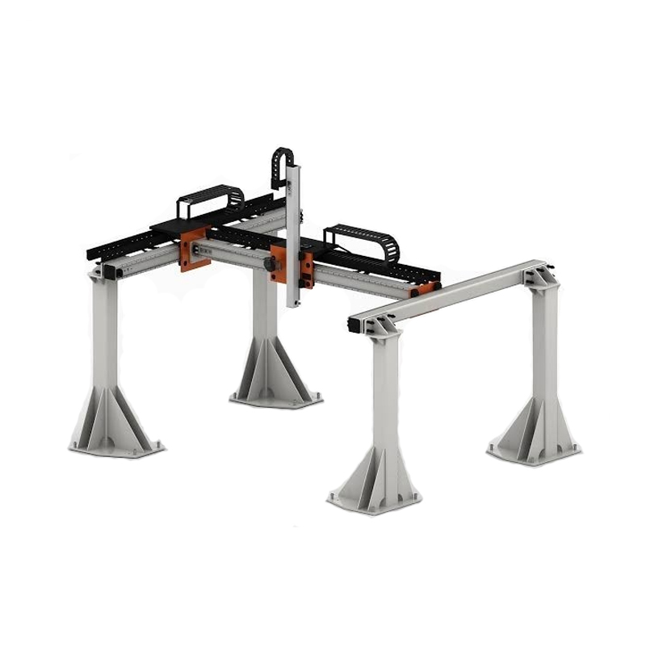
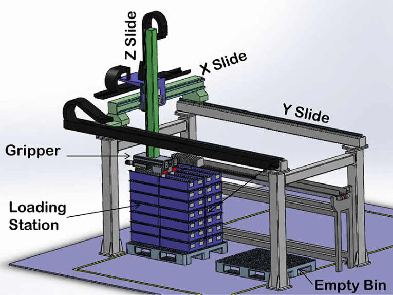

# PPP Gantry Robot (v1.0)

> **Release:** v1.0 · **Scenario:** SC-v10 (`ppp_warehouse`) ·
> [Release spec](../releases.md#v10--ppp-gantry-warehouse-pick-and-place)

---

## Overview

The PPP robot is a **3-axis gantry manipulator** with prismatic joints along X, Y, and Z.
It models an industrial high-bay warehouse crane used for pallet and box handling.

Configuration space **is** Cartesian workspace position: `q = (x, y, z)` in metres.

### Mechanical layout (reference)

Industrial Cartesian / gantry robots use **two parallel overhead rails**
that sustain a cross bridge. The bridge carries the Y trolley; a Z column
and gripper hang below. FRET's MJCF reproduces this topology procedurally.



*Reference: overhead dual-rail Cartesian gantry with four corner posts,
orange carriages, and a vertical Z column. Source:
[ecdn6.globalso.com](https://ecdn6.globalso.com/upload/p/2394/image_other/2024-09/cartesian-robot-1-1.jpg)
— vendor product photo, included for mechanical layout only.*

### Axis convention

| Axis | MJCF joint | Motion | Visual element |
|---|---|---|---|
| **X** | `joint_x` | Bridge travels along the long aisle (0–12 m preview) | Orange carriages on both parallel rails |
| **Y** | `joint_y` | Trolley travels across the bridge (0–4 m preview) | Orange Y trolley on the X beam |
| **Z** | `joint_z` | Column + gripper move vertically (0–3 m preview) | Green Z column descending to the spreader |



*Reference: Y-slide = parallel overhead rails, X-slide = cross bridge,
Z-slide = vertical column + gripper. Source:
[cdn.goodao.net](https://cdn.goodao.net/fuyumotion/Gantry-Robot-Linear-Motion-System-XYZ-Positioning-Stage.png)
— vendor diagram, included for axis labelling only.*

---

## Kinematic model

| Joint | Type | Range (v1.0) | Max velocity |
|---|---|---|---|
| `joint_x` | Prismatic | [0, 60] m | 3.0 m/s |
| `joint_y` | Prismatic | [0, 20] m | 3.0 m/s |
| `joint_z` | Prismatic | [0, 6] m | 1.5 m/s |

Forward kinematics: `p_ee = q` (identity map).

Inverse kinematics: `q_goal = p_target` (direct, no redundancy).

---

## End-effector

| Property | Value |
|---|---|
| Face size | 0.5 m × 0.5 m |
| Safety clearance | 1.5 m (≈ 2 × face diagonal) |

---

## Magnetic grasp (v1.0)

The cargo box attaches to the EE without a gripper mechanism:

```
IDLE → APPROACH → CAPTURE (weld) → TRANSPORT → RELEASE → IDLE
```

| State | Condition |
|---|---|
| CAPTURE | `‖p_ee − p_box‖ < capture_radius` |
| TRANSPORT | Box pose = EE pose + offset (fixed weld) |
| RELEASE | `‖p_ee − p_goal‖ < goal_radius` |

The welded box geometry is included in collision checking during TRANSPORT.

---

## ARCO alignment

FRET v1.0 PPP scenarios derive obstacle layouts from ARCO:

- `arco/map/ppp.yml`
- `arco/simulator/scenes/ppp.py`

Planning uses ARCO `SSTPlanner` with `KDTreeOccupancy` in 3-D C-space.

---

## Assets

| File | Purpose |
|---|---|
| `src/fret/mjcf/ppp_warehouse.xml` | MuJoCo overhead gantry + AWS warehouse meshes |
| `src/fret/mjcf/assets/aws_warehouse/` | MIT-0 shelf/box visuals + floor/wall textures |
| `scripts/import_aws_warehouse_assets.py` | Regenerate AWS mesh assets from upstream repo |
| `src/fret/urdf/ppp.xacro` | Gazebo backend (optional; v1.2+) |
| `scripts/view.sh` | MuJoCo interactive viewer (v1.0) |
| `src/fret/config/scenarios/ppp_warehouse.yml` | SC-v10 scenario |

The MJCF models a **gate-style Cartesian gantry** (procedural primitives) inside an
**AWS RoboMaker warehouse** shell (MIT-0 meshes for shelves, box clusters, floor,
and wall). Collision boxes are unchanged for planning and perception alignment.

For asset provenance and regeneration, see
`src/fret/mjcf/assets/aws_warehouse/README.md`.
