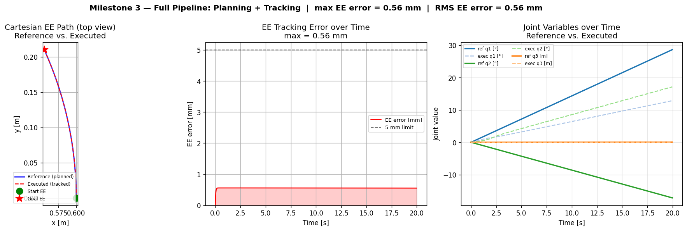

# FretSim — Simulation Tutorial

This document provides step-by-step instructions to download, build, and run the
FRET simulation stack (FretSim) from scratch.

Two modes are available:

| Mode | Requirements | Purpose |
|---|---|---|
| **Pure-Python** | Python 3.10+, numpy, matplotlib | Validate all milestone algorithms offline |
| **Full SITL** | Ubuntu 24.04, ROS 2 Jazzy, Gazebo Harmonic | Real-time simulation with physics |

---

## Prerequisites

- Ubuntu 24.04 (or WSL2 on Windows)
- `git` installed and configured
- Internet access for package installation

---

## Step 1 — Clone the repository

```bash
git clone https://github.com/alexandrelheinen/fret.git
cd fret
```

---

## Step 2 — Install system dependencies

Run the provided installer (requires `sudo`). It installs ROS 2 Jazzy,
Gazebo Harmonic, Python tools, and clang-format:

```bash
./scripts/install.sh -y
```

To install and set up the ROS workspace in one command:

```bash
./scripts/setup.sh --install -y
```

> **What gets installed:**
> - ROS 2 Jazzy Desktop (`ros-jazzy-desktop`, `ros-dev-tools`)
> - Gazebo Harmonic (`gz-harmonic`, `ros-jazzy-ros-gz`)
> - Build tools: `colcon`, `rosdep`, `vcstool`
> - Python tools: `black`, `isort`, `pytest`
> - C++ tools: `clang-format`

---

## Step 3 — Build the workspace

```bash
./scripts/build.sh
```

This runs `colcon build`, generates URDF files from XACRO, generates STL meshes,
and installs all launch and config files.

Build artefacts are written to `build/`, `install/`, and `log/`.

---

## Step 4 — Activate the environment

Every terminal that runs FRET nodes must source both overlays:

```bash
source /opt/ros/jazzy/setup.bash
source install/setup.bash
```

---

## Step 5A — Pure-Python simulation (no Gazebo required)

The pure-Python pipelines run all milestone algorithms end-to-end without Gazebo.
They are the primary CI validation path.

### Milestone 1 — Straight-line tracking

```bash
bash scripts/simulate_milestone1.sh --output /tmp/sim_ms1
```

Expected output:
```
✅ Simulation PASSED — EE error ≤ 5 mm (max: 4.11 mm)
```

### Milestone 2 — Planning pipeline

```bash
bash scripts/simulate_milestone2.sh --output /tmp/sim_ms2
```

Expected output:
```
✅ Simulation PASSED - 2 waypoints, EE error = 0.00 mm
```

### Milestone 3 — Full end-to-end (planning + tracking)

This is the primary A-to-B demonstration. The SCARA moves from
`[0.0, 0.0, 0.0]` (home) to `[0.5, -0.3, 0.05]` over 20 seconds:

```bash
python3 scripts/simulate_milestone3_pipeline.py --output /tmp/sim_ms3
```

Expected output:
```
=== Milestone 3 end-to-end simulation (planning + tracking) ===
Start config  : [0.0, 0.0, 0.0]
Goal  config  : [0.5, -0.3, 0.05]
Sim duration  : 20 s  (1000 steps @ 50 Hz)
Plot saved to /tmp/sim_ms3/tracking_plots.png

--- Results ---
  PLANNING_DURATION_S = 0.0001
  N_WAYPOINTS = 2.0000
  MAX_EE_ERROR_MM = 0.5594        ← well below 5 mm limit
  RMS_EE_ERROR_MM = 0.5563
  FAULT_TRIGGERED = 0.0000

✅ Simulation PASSED
```

The plot at `/tmp/sim_ms3/tracking_plots.png` shows:
- EE path in Cartesian (x, y) — reference vs. executed
- EE tracking error over time
- Joint variables over time (q1, q2, q3)



### Milestone 4 — Workspace occupancy map

```bash
python3 scripts/simulate_milestone4_pipeline.py --output /tmp/sim_ms4
```

Expected output:
```
✅ [M4] PASSED — 19 occupied voxels, 59 free voxels
```

3-D scatter plot at `/tmp/sim_ms4/occupancy_map.png`.

### SC-05 — Arc trajectory scenario

```bash
bash scripts/simulate_arc.sh --output /tmp/sim_arc
```

Expected output:
```
✅ Simulation PASSED — max EE error = 2.96 mm
```

### SC-01 — Static reach (full pipeline)

```bash
bash scripts/simulate_static_reach.sh --output /tmp/sim_sc01
```

Expected output:
```
✅ SC-01 static-reach PASSED — planning SUCCESS, no fault
```

---

## Step 5B — Full SITL with Gazebo

> **Requires:** Steps 1–4 completed, Gazebo running with a display.

### Visualize the SCARA model in RViz

```bash
ros2 launch fret view.py model:=scara
```

### Run the SCARA in Gazebo (manual joint control)

```bash
ros2 launch fret sim.py model:=scara
```

### Run the full SITL pipeline (planning + control + execution)

```bash
ros2 launch fret sitl.py model:=scara scenario:=static_reach
```

Other available scenarios:

```bash
# Milestone 1: controller only (no planner), straight-line trajectory
ros2 launch fret sitl.py model:=scara scenario:=straight_line

# SC-05: arc trajectory
ros2 launch fret sitl.py model:=scara scenario:=arc

# SC-02: obstacle avoidance
ros2 launch fret sitl.py model:=scara scenario:=obstacle_avoidance

# SC-03: planning failure / timeout
ros2 launch fret sitl.py model:=scara scenario:=planning_timeout
```

### Record a ROS bag

```bash
ros2 launch fret sitl.py model:=scara scenario:=static_reach
# In a second terminal:
source /opt/ros/jazzy/setup.bash && source install/setup.bash
mkdir -p log/bags
ros2 bag record -o log/bags/sitl_run /joint_states /joint_commands /joint_trajectory
```

---

## Running Unit Tests

```bash
source /opt/ros/jazzy/setup.bash
source install/setup.bash
pytest tests/ -v
```

---

## Log Locations

| Log type | Path |
|---|---|
| Build (colcon) | `./log/latest_build/logger_all.log` |
| ROS 2 runtime | `~/.ros/log/latest/launch.log` |
| Gazebo server | `~/.gz/sim/log/<timestamp>/server_console.log` |
| Simulation results | `/tmp/sim_<name>/results.env` (or `--output` path) |

---

## Known Issues

See the [v1.0 release assessment](../README.md#release-assessment) for a full
list of known limitations.
