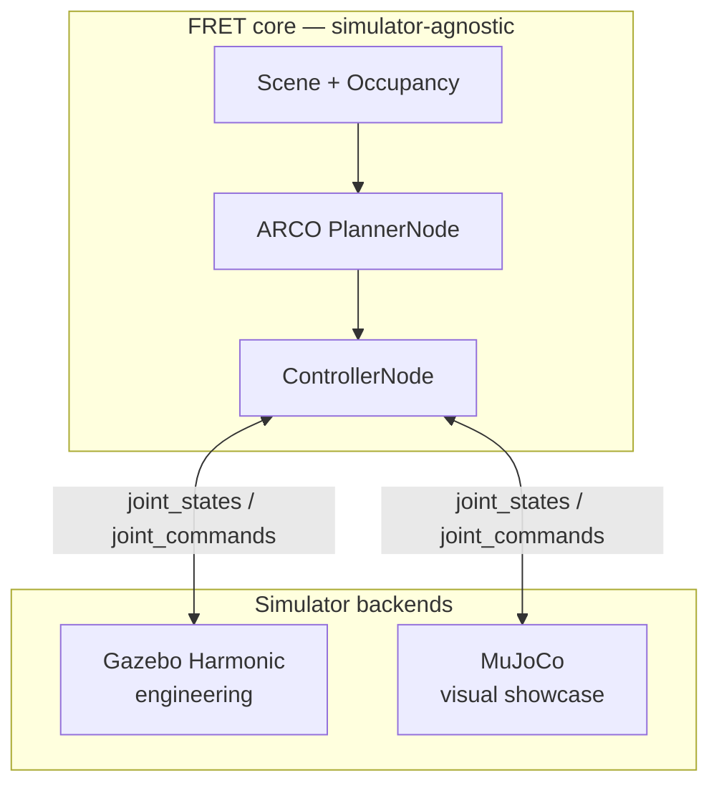

# FRET v1.0 — Release Goals and Acceptance Criteria

> **Status:** In progress (post MS-5)  
> **Platform study:** [simulation-platform-study-2026-q3.md](reports/simulation-platform-study-2026-q3.md)  
> **Roadmap:** [roadmap.md](roadmap.md) · **Milestones:** [milestones.md](milestones.md)

---

## Vision

FRET v1.0 is a **demonstrable, documented, and reproducible** full-stack manipulator
framework that showcases:

1. **ARCO** as the author-owned motion-planning library (C-space SST, occupancy, pruning).
2. **Gazebo Harmonic** as the engineering SITL backend (ROS-native, CI-friendly, HITL path).
3. **MuJoCo** as the visual showcase backend (smooth physics, polished rendering for demos and articles).

The SCARA (3-DOF RRP) was the **bootstrap robot** — chosen because it was already validated
on ARCO and allowed rapid V-cycle iteration through MS-1–5. The **v1.0 showcase scenario**
(robot topology + environment + narrative) is **intentionally deferred** to a follow-up
design session once this documentation is in place.

---

## Platform decisions (locked, 2026 Q3)

| Layer | Choice | Rationale |
|---|---|---|
| Motion planning | **ARCO** (Python) | Ownership, lightweight API, already integrated |
| Engineering simulator | **Gazebo Harmonic** | ROS 2 bridge exists; hardware path compatible |
| Visual simulator | **MuJoCo** | Best balance of aesthetics vs. integration cost |
| Deferred | Isaac Sim, OMPL replacement | Overkill or post-v1.0 research |

See the full comparative study in
[docs/reports/simulation-platform-study-2026-q3.md](reports/simulation-platform-study-2026-q3.md).

---

## What v1.0 is / is not

| v1.0 **is** | v1.0 **is not** |
|---|---|
| A polished demo of ARCO + FRET on a showcase scenario | A general-purpose MoveIt replacement |
| Dual-simulator support (Gazebo + MuJoCo) behind one pipeline | Isaac Sim integration |
| Documented, tested, CI-validated core algorithms | Hardware HITL (Phase 3) |
| A base for a 2026 Q3 article on robotics simulation | Final physical delta robot (Phase 4) |

---

## Milestone path to v1.0

MS-1 through MS-5 established the algorithm stack on SCARA + Gazebo. The remaining
milestones target the v1.0 release:

```
MS-1  ✅  Controller + straight-line tracking
MS-2  ✅  Planning pipeline → /joint_trajectory
MS-3  ✅  Full pipeline executed by Jacobian controller
MS-4  ✅  Workspace occupancy map
MS-5  ✅  Pillar avoidance (pure-Python; Gazebo SITL validation pending)
  │
  ▼
MS-6  🔲  MuJoCo visual backend (MJCF model, launch, render pipeline)
  │
  ▼
MS-7  🔲  v1.0 showcase scenario (robot + environment — TBD)
  │
  ▼
v1.0.0  Polished demo + article-ready assets
```

Detailed acceptance criteria for MS-6 and MS-7 are in [milestones.md](milestones.md).

---

## v1.0 acceptance criteria (release gates)

All criteria must pass before tagging `v1.0.0`.

### A. Algorithm core (inherited from MS-1–5)

| # | Criterion | Status |
|---|---|---|
| A-1 | EE tracking error ≤ 5 mm on showcase scenario | 🟡 MS-3 passes; showcase TBD |
| A-2 | Planning completes within 30 s or returns structured `ABORTED` | ✅ |
| A-3 | C-space collision checking via FK + `KDTreeOccupancy` | ✅ |
| A-4 | Unit test coverage ≥ 90 % on core modules | ✅ |
| A-5 | All CI workflows pass (formatting, types, tests, simulations) | ✅ |

### B. ARCO integration

| # | Criterion | Status |
|---|---|---|
| B-1 | ARCO SST planner active in at least one CI job | 🔲 |
| B-2 | `benchmark.yaml` quality gates pass with real SST (not fallback) | 🔲 |
| B-3 | ARCO boundary documented and respected (no ROS in ARCO) | ✅ |

### C. Gazebo engineering backend

| # | Criterion | Status |
|---|---|---|
| C-1 | `sitl.py` launches without errors on Ubuntu 24.04 + Jazzy | 🟡 Manual only |
| C-2 | Gazebo SITL smoke test in CI (headless `sim.py` or `sitl.py`) | 🔲 |
| C-3 | ROS bag recorded from a real Gazebo run of the showcase scenario | 🔲 |
| C-4 | Live obstacle perception from Gazebo (or documented YAML bridge) | 🔲 |

### D. MuJoCo visual backend

| # | Criterion | Status |
|---|---|---|
| D-1 | MJCF model for the showcase robot | 🔲 |
| D-2 | `ros2 launch fret mujoco.py` (or equivalent) runs headless + GUI | 🔲 |
| D-3 | Same scenario YAML drives both Gazebo and MuJoCo backends | 🔲 |
| D-4 | Article-ready screenshot or short video (< 30 s) of showcase run | 🔲 |

### E. Showcase scenario (TBD)

| # | Criterion | Status |
|---|---|---|
| E-1 | Robot model and environment selected and documented | 🔲 Design session |
| E-2 | Scenario YAML with pass criteria defined (SC-v1) | 🔲 |
| E-3 | End-to-end run on Gazebo **and** MuJoCo | 🔲 |
| E-4 | Narrative paragraph for article/README | 🔲 |

---

## Implementation tasks

Tasks are ordered by dependency. Each maps to a roadmap phase and milestone.

### Phase 5a — Close MS-5 gaps (Gazebo engineering)

| ID | Task | Milestone | Priority |
|---|---|---|---|
| T-501 | Validate `pillar_avoidance` in live Gazebo SITL | MS-5 | High |
| T-502 | Add Gazebo headless smoke test to CI | MS-5 | High |
| T-503 | Wire `ReplanningManager` into `sitl.py` | MS-5 | Medium |
| T-504 | Add ARCO-enabled CI job (`pip install arco`) | B-1 | High |
| T-505 | Record and publish a Gazebo ROS bag for pillar scenario | C-3 | Medium |

### Phase 5b — MuJoCo visual backend

| ID | Task | Milestone | Priority |
|---|---|---|---|
| T-601 | Evaluate `mujoco` Python bindings vs `mujoco_ros2_control` | MS-6 | High |
| T-602 | Create MJCF model (SCARA first, migrate with showcase robot) | MS-6 | High |
| T-603 | Implement `fret.ros.mujoco_bridge` (joint I/O adapter) | MS-6 | High |
| T-604 | Add `launch/mujoco.py` with `backend:=mujoco` flag on `sitl.py` | MS-6 | High |
| T-605 | Headless MuJoCo render → PNG/video for CI artifact | MS-6 | Medium |
| T-606 | Side-by-side benchmark: Gazebo vs MuJoCo on SC-01 | MS-6 | Low |

### Phase 5c — v1.0 showcase scenario

| ID | Task | Milestone | Priority |
|---|---|---|---|
| T-701 | Design session: select robot + environment for v1.0 | MS-7 | **Next** |
| T-702 | Define SC-v1 scenario YAML and pass criteria | MS-7 | High |
| T-703 | Port or create robot model (URDF + MJCF) for showcase | MS-7 | High |
| T-704 | Run SC-v1 end-to-end on Gazebo and MuJoCo | MS-7 | High |
| T-705 | Write article section + README demo GIF/video | MS-7 | Medium |
| T-706 | Tag `v1.0.0` release | v1.0 | Final |

---

## Architecture constraint (dual backend)

The simulator is a **replaceable backend** behind the same pure-Python pipeline:



No planning or control logic may depend on a specific simulator API. All
simulator-specific code lives in `fret.ros` and `launch/`.

---

## Open questions (for the design session)

1. **Robot:** Keep SCARA, switch to a 6-DOF arm, or use a delta topology closer to the physical target?
2. **Environment:** Pillars (proven), pick-and-place table, or a more visually rich scene?
3. **Narrative:** Academic (benchmark tables) or portfolio (cinematic MuJoCo video)?
4. **OMPL benchmark:** Include a side-by-side ARCO vs OMPL table in the article, or defer to v1.1?

---

## Version tagging plan

| Tag | Meaning | When |
|---|---|---|
| `v0.9.0` | MS-1–5 algorithm core complete | Now (or after MS-5 Gazebo validation) |
| `v1.0.0-rc1` | MS-6 MuJoCo backend functional | After T-604 |
| `v1.0.0` | Full showcase scenario on both backends | After T-706 |

---

## References

- [Platform study (2026 Q3)](reports/simulation-platform-study-2026-q3.md)
- [Project roadmap](roadmap.md)
- [Milestones MS-1–7](milestones.md)
- [Functional requirements](requirements.md)
- [Scenario library](scenarios.md)
- [Simulation tutorial](simulation.md)
- [ARCO integration](arco.md)
