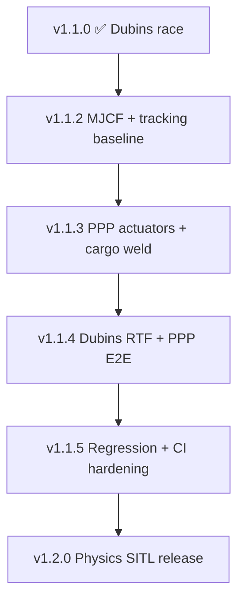

# Version plan: v1.1.x → v1.2.0 (MuJoCo physics SITL)

> **Purpose:** Execution plan for intermediate **v1.1.x** tags between the v1.1.0
> product release (Dubins race) and the v1.2.0 physics milestone.
>
> **Authoritative acceptance criteria:** [releases.md § v1.2](releases.md#v12--mujoco-physics-sitl)  
> **Engineering spec:** [mujoco_physics_v1.2.md](mujoco_physics_v1.2.md)  
> **Roadmap context:** [roadmap.md § Phase 4](roadmap.md#phase-4--v12-mujoco-physics-sitl-)

---

## Versioning policy

| Tag family | Meaning |
| --- | --- |
| `v1.0.0`, `v1.1.0`, … | **Product releases** — new robot and/or showcase scenario |
| `v1.1.x` | **Physics-bridge iterations** between v1.1.0 and v1.2.0; not new robots |
| `v1.2.0` | **Physics SITL product release** — PPP + Dubins execute under `mj_step` |

**Rules for v1.1.x tags**

1. **No new robots or scenarios** — physics validation uses SC-v10 (`ppp_warehouse`) and SC-v11 (`dubins_race`) only.
2. **Kinematic showcase remains default** until the final v1.2.0 gate (release CI uses `--kinematic-mode`; physics clips are opt-in via `--physics-mode`).
3. Each v1.1.x tag must be **CI-green** and must not regress v1.0 / v1.1 kinematic behaviour.
4. A v1.1.x tag is **releasable** only when its exit criteria are met; partial physics work stays on `main` without a tag.

---

## Current state (post #88, main)

Infrastructure from the v1.2 branch landed early on `main`. Status against T12 tasks:

| Task | Description | Status |
| --- | --- | --- |
| T12-01 | `step_physics()` / `physics_mode` on bridge | ✅ Done |
| T12-02 | PPP MJCF actuators + `mujoco_physics.yml` | ✅ Done |
| T12-03 | Dubins MJCF actuators | ✅ Done |
| T12-04 | Cargo weld equality + bridge FSM hook | ⚠️ Partial — weld engages; floor contact blocks lift/transit |
| T12-05 | Contact logging + metrics JSON | ✅ Done |
| T12-06 | Physics integration tests | ⚠️ Partial — relaxed PPP tracking gate; no `grasp_released` assertion |
| T12-07 | Showcase `--physics-mode` flag | ✅ Done — kinematic default restored (#88) |
| T12-08 | Tuning workflow docs | ⚠️ Partial — see [mujoco.md](mujoco.md) |

### Known physics gaps (investigation summary)

**PPP gantry (SC-v10)**

| Symptom | Root cause | Fix track |
| --- | --- | --- |
| Robot stalls after pick; no XY transit | Gantry MJCF geoms self-collide → `qfrc_constraint` cancels actuators | v1.1.2 — collision policy (#88 started: visual-only gantry geoms) |
| Carrot never advances horizontally | `max_carrot_lag = 3 mm` too tight for `mj_step` lag | v1.1.2 — physics tracking profile (#88 started: 0.12 m floor in runner) |
| Cannot lift welded cargo | Magnetic weld + `cargo_box` floor contact over-constrain Z | v1.1.3 — weld / contact handoff |
| `grasp_released = false`, tracking fault | Consequence of above | v1.1.4 — E2E acceptance |

**Dubins race (SC-v11)**

| Symptom | Root cause | Fix track |
| --- | --- | --- |
| Physics sim ~5× slower than kinematic (~180 s vs ~37 s) | Actuator lag + closed-loop physics tracking | v1.1.4 — gain tuning + reference blend |
| Release render 25–45+ min with `--physics-mode --full-duration` | ~5300 frames × 2 POVs at 30 fps | v1.1.5 — RTF target or dev-only physics clips until v1.2.0 |
| Both agents reach goal under physics | — | ✅ Works today |

**Release pipeline**

| Item | Status |
| --- | --- |
| v1.1.1 physics-default showcase | ❌ Skipped — not released |
| #88 kinematic release default | ✅ Merged |
| v1.2.0 physics showcase switch | 🔲 Last step before tag |

---

## Iteration plan

### v1.1.2 — MJCF collision policy & physics tracking baseline

**Goal:** PPP gantry moves under `physics_mode` on a straight-line smoke path; release pipeline stays kinematic.

| ID | Work item | Verification |
| --- | --- | --- |
| V112-01 | Finalise gantry geom collision policy in `ppp_warehouse.xml` (visual-only frame; contacts on `obs_*`, floor, `cargo_box` only) | Unit: direct `step_physics([1,0,0])` moves X ≥ 1 m in 5 s |
| V112-02 | Align joint damping with actuator `kv` in `mujoco_physics.yml` | No `qfrc_constraint` cancellation on prismatic joints during smoke move |
| V112-03 | Add `config/controllers/ppp_physics.yml` (or `physics:` section in `ppp.yml`) with relaxed `max_carrot_lag`, optional `race_speed` | `PPPWarehouseRunner(physics_mode=True)` carrot advances on horizontal segment |
| V112-04 | Document v1.1.x policy in this file + [releases.md](releases.md) version table | — |

**Exit criteria (tag `v1.1.2`)**

- [x] PPP physics smoke: 2 m X transit at Z = 2.4 m completes in &lt; 30 s sim
- [x] Kinematic release renders unchanged (CI `release.yml` `--kinematic-mode`)
- [x] All existing unit + integration tests green

---

### v1.1.3 — PPP cargo weld & pick/place physics

**Goal:** Magnetic grasp works under physics: pick, lift, transit, place.

| ID | Work item | Verification |
| --- | --- | --- |
| V113-01 | Weld timing: engage weld only after EE reaches pick depth **or** lift-break floor contact before transit | `grasp_captured` with zero sustained floor penetration force on cargo |
| V113-02 | Cargo contact policy during TRANSPORT (weld active): disable `cargo_box`↔floor contact; re-enable on RELEASE | Contact log: no floor contacts while welded and Z &gt; pick height |
| V113-03 | Tune Z actuator `kv` / `forcerange` for loaded hoist (welded 2 kg box) | Lift from pick Z to cruise Z in &lt; 15 s sim |
| V113-04 | PPP physics integration test: require `grasp_released = true` | `test_mujoco_physics_ppp.py` |

**Exit criteria (tag `v1.1.3`)**

- [ ] `PPPWarehouseRunner(physics_mode=True)` completes operational path
- [ ] `grasp_captured` and `grasp_released` both true
- [ ] `penetration_violations == 0`
- [ ] `max_tracking_error_m ≤ 0.025` (intermediate gate; 10 mm is v1.2.0)

---

### v1.1.4 — Dubins physics RTF & PPP tracking to spec

**Goal:** Both scenarios meet near-final performance; Dubins physics sim RTF ≤ 2× kinematic.

| ID | Work item | Verification |
| --- | --- | --- |
| V114-01 | Tune Dubins `kv` / `forcerange` and `_PHYSICS_REFERENCE_BLEND` in `dubins_race_runner.py` | Race duration ≤ 75 s sim (2× kinematic baseline ~37 s) |
| V114-02 | PPP `max_tracking_error_m ≤ 0.010` (V12-2) | `test_mujoco_physics_ppp.py` strict gate |
| V114-03 | ROS SITL smoke: `physics_mode:=true` for PPP + Dubins (`scripts/tests/smoke.sh`) | 30 s timeout, no crash |
| V114-04 | `/joint_states` from simulated `qpos`/`qvel` only (FR-SIM-07) | Integration assertion or launch test |

**Exit criteria (tag `v1.1.4`)**

- [ ] V12-2 PPP tracking ≤ 10 mm
- [ ] V12-3 Dubins both agents reach goal; column contacts logged
- [ ] V12-4 joint state provenance
- [ ] Physics PPP E2E wall time ≤ 120 s on CI runner

---

### v1.1.5 — Regression harness & release prep

**Goal:** Kinematic vs physics regression artifacts; CI ready for v1.2.0 showcase switch.

| ID | Work item | Verification |
| --- | --- | --- |
| V115-01 | Kinematic vs physics MP4 regression (path-length ratio ≤ 1.15; SSIM ≥ 0.85 warn) per [mujoco_physics_v1.2.md § regression](mujoco_physics_v1.2.md#kinematic-vs-physics-regression-clip-t12-07) | Artifact under `/tmp/fret_physics/<scenario>/regression/` |
| V115-02 | Contact log required in CI for both scenarios (V12-5) | `metrics.json` + `contacts.jsonl` in integration job |
| V115-03 | Physics showcase dry-run: `--physics-mode --full-duration` completes within release job timeouts (PPP 30 min, Dubins 45 min) | Manual or `workflow_dispatch` release run |
| V115-04 | Tighten [mujoco.md § tuning workflow](mujoco.md#controller-tuning-workflow-v12) with measured baselines | Doc review |

**Exit criteria (tag `v1.1.5`)**

- [ ] All V12-1 – V12-7 criteria pass on `main`
- [ ] Physics showcase dry-run green
- [ ] No relaxed multipliers in physics integration tests

---

### v1.2.0 — MuJoCo physics SITL (product release)

**Goal:** Ship physics as the default simulation mode for v1.0 + v1.1 scenarios.

| ID | Work item | Verification |
| --- | --- | --- |
| V120-01 | Switch `release.yml` from `--kinematic-mode` to `--physics-mode` | R2 MP4s show physically actuated motion |
| V120-02 | Update [tutorial.md](tutorial.md) / [simulation.md](simulation.md) default examples | Docs match release behaviour |
| V120-03 | Tag `v1.2.0`; update [roadmap.md](roadmap.md) Phase 4 ✅ | — |

**Exit criteria (tag `v1.2.0`)** — full [releases.md § v1.2 acceptance](releases.md#acceptance-criteria-2):

| # | Criterion |
| --- | --- |
| V12-1 | `physics_mode:=true` SITL launches for PPP and Dubins without error |
| V12-2 | PPP pick-and-place completes; EE error ≤ 10 mm; no obstacle penetration |
| V12-3 | Dubins agents reach B; column contact response; no ghosting |
| V12-4 | `/joint_states` from sim clock; no open-loop pose injection |
| V12-5 | Contact log artifact in CI for both scenarios |
| V12-6 | Controller tuning guide in [mujoco.md](mujoco.md) |
| V12-7 | Physics regression tests in `tests/integration/` |

---

## Configuration & tuning reference

### Files to touch per iteration

| File | Role |
| --- | --- |
| `src/fret/mjcf/ppp_warehouse.xml` | Gantry collision policy, joint damping |
| `src/fret/mjcf/dubins_race.xml` | Agent actuators, structure contacts |
| `src/fret/config/simulation/mujoco_physics.yml` | `kv`, `forcerange` per model |
| `src/fret/config/controllers/ppp.yml` | Kinematic carrot / race speed (unchanged default) |
| `src/fret/config/controllers/ppp_physics.yml` | *New* — physics tracking profile (v1.1.2) |
| `src/fret/config/controllers/dubins.yml` | Pure Pursuit (kinematic reference) |
| `src/fret/scenario/ppp_warehouse_runner.py` | Physics carrot path, grasp tick |
| `src/fret/scenario/dubins_race_runner.py` | `_PHYSICS_*` gains and lag clamps |
| `src/fret/ros/mujoco_bridge.py` | `sync_cargo_grasp`, weld lifecycle |
| `scripts/render_mujoco.py` | Showcase mode flags |
| `.github/workflows/release.yml` | Kinematic until v1.2.0; then physics |

### Tuning workflow (repeat per scenario)

1. **Kinematic baseline** — record tracking error, path duration, release MP4.
2. **Enable physics** — `physics_mode:=true` or `PPPWarehouseRunner(physics_mode=True)`.
3. **Fix MJCF collisions** — eliminate self-penetration; verify `qfrc_constraint ≈ 0` on commanded axis.
4. **Tune actuators** — adjust `kv` and `forcerange` in `mujoco_physics.yml`.
5. **Tune tracking** — physics carrot lag / reference blend until path completes.
6. **Validate contacts** — `contact_log_enabled: true`; inspect `penetration_violations`.
7. **Regression clip** — compare kinematic vs physics MP4 before switching release default.

---

## What v1.2.0 does *not* include

Deferred to v1.3+ (documented in [mujoco_physics_v1.2.md](mujoco_physics_v1.2.md)):

- True Dubins non-holonomic wheel actuators (holonomic X/Y slides remain)
- Gantry leg↔floor sliding friction model (gantry frame is visual-only)
- New robots (RRP, 6-DOF)
- Hardware HITL

---

## Traceability

| Plan ID | Release task | Requirement |
| --- | --- | --- |
| V112-* | T12-02, T12-08 | FR-SIM-07, FR-SIM-09 |
| V113-* | T12-04 | FR-GSP-01 – FR-GSP-04 |
| V114-* | T12-01, T12-03, T12-06 | FR-CTL-02, FR-SIM-07 |
| V115-* | T12-05, T12-07 | FR-SIM-08 |
| V120-* | T12-* (all) | V12-1 – V12-7 |

---

## Skipped / retrospective

| Tag | Notes |
| --- | --- |
| `v1.1.1` | Communication tag on #88 — physics bridge checkpoint; kinematic release restore |
